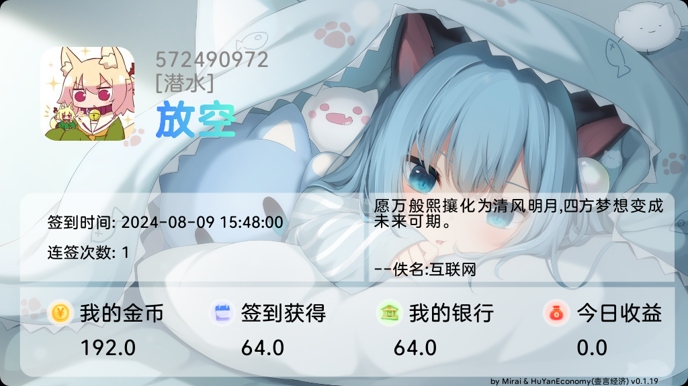

# HuYanEconomy 壶言壶言经济 --- 娱乐插件

[](https://github.com/Moyuyanli/HuYanEconomy/releases) [](https://github.com/Moyuyanli/HuYanEconomy/releases/download/v1.5.0/HuYanEconomy-1.5..mirai2.jar)

这里是壶言经济，一款mirai娱乐插件，设计灵感来自于论坛的经济帖子，心血来潮就创建了这个项目，从22年11月开始，中间慢慢填坑，
陆陆续续的完成了一部分饼，由于大部分饼都没实现，所以没在论坛发布，但是在我群共享。

或许有些人在一些群见过本插件的功能，就比如这个签到



现在完成了一些基本功能，仍然有很多bug的存在，但是能用(叉腰)。
开个玩笑，如果遇见bug可以去[github](https://github.com/Moyuyanli/HuYanEconomy/issues)提issues。

或者有什么好的建议也可以提。

## 使用

本插件需要前置:

* [mirai-economy-core](https://github.com/cssxsh/mirai-economy-core)
  依赖于:[mirai-hibernate-plugin](https://github.com/cssxsh/mirai-hibernate-plugin)
* [HuYanAuthorize](https://github.com/Moyuyanli/HuYanAuthorize)

前置插件和插件本体一起放入plugins文件夹后，启动一次mirai，再停止。
进入`config/cn.chahuyun.HuYanAuthorize`中配置`AuthorizeConfig.yml`:

这里的主人，才是真主人。

```yml
# 主人
owner: 123456
# 是否开启方法代理
proxySwitch: false
# 数据库类型(H2,SQLITE,MYSQL)
dataType: H2
# mysql数据库连接地址
mysqlUrl: '127.0.0.1:3306/authorize'
# mysql数据库用户名
mysqlUser: root
# mysql数据库密码
mysqlPassword: 123456
```

进入`config/cn.chahuyun.HuYanEconomy`中配置`config`:

这里的主人暂时不可用。

```yml
# 主人
owner: 123456
# 指令触发前缀
prefix: ''
# 数据库类型(H2,MYSQL,SQLITE)
dataType: MYSQL
# mysql 连接地址
mysqlUrl: 'localhost:3306/economy'
# mysql 用户名
mysqlUser: root
# mysql 密码
mysqlPassword: 123456
# 插件单一管理botQQ
bot: 123456
```

请设置主人用于管理本插件！

由于限制，本插件无法实现多bot，只能用于唯一bot，所以请指定botqq。

数据库可以自定义指定，目前只实现了3种数据库。

设置完成后，再次启动mirai即可使用本插件。

## 开发与构建

本项目使用 Gradle + mirai-console 插件打包任务。

- Windows：`./gradlew.bat buildPlugin`
- Linux/macOS：`./gradlew buildPlugin`

构建产物默认输出到 `build/mirai/`，文件名类似：`HuYanEconomy-<version>.mirai2.jar`。

## 功能列表

由于一些功能上的设计缺陷，修复他们需要改动数据库，导致数据库的数据错误，因此需要执行修复指令：`hye repair`;

建议在控制台执行,并且最好是启动后先执行。只需要执行一次就行

目前已知需要修复版本:

- 1.4.3 -> 1.4.4
- 1.4.5 -> 1.4.6

### 经济功能

基于[mirai-economy-core](https://github.com/cssxsh/mirai-economy-core)经济前置，注册货币为`hy-gold`。

目前实现功能有:

- [x] 转账
- [x] 存款
- [x] 取款
- [x] 抢劫
- [x] 红包

### 签到功能

指令`sign`,`签到`,`打卡`,`关闭签到`,`开启签到`;

完成签到会生成一张图片签到信息，当图片签到失败后会发送文字签到。
签到图片目前支持背景自定义。

只需要将图片放入`data/cn.chahuyun.HuYanEconomy/bottom`即可，每次启动都会读取一次文件夹里面的图片。
`data/cn.chahuyun.HuYanEconomy/font`是自定义字体。

背景图自动轮询。

签到的刷新是每天的4点，可自定义时间。
随机获得`50~500`的金币奖励！
概率不均衡

### 用户功能

指令`个人信息`,`info`,`money`,`经济信息`,`我的资金`;

可以生成一张当前用户的个人信息。
同时获取[一言](https://hitokoto.cn/)

对于昵称区域，群主是一个独立的渐变色，管理员是一种，群成员又是一种。
部分功能会影响到颜色。

### 银行功能

指令`存款 (额度)`,`deposit (额度)`,`取款 (额度)`,`withdraw (额度)`,`银行利率`,`富豪榜`;

银行功能设计之初支持多银行管理。
但是目前只实现了主银行，也就是全局银行。

以后可能会完成之前画的饼。

银行有每周利息，利息随概率变动。

变动规则:

* 70% `1~3`%
* 29% `4~7`%
* 1% `-3~-1`%(经济危机！！！)

#### 银行扩展（2.0.0，PrivateBank 模块）

用户侧统一称为“银行”（代码层模块名仍为 PrivateBank，保留“私银/私人银行”作为兼容别名）。

常用指令（以实际权限配置为准）：

- `银行创建 <code> <name>`
- `银行描述修改`
- `银行利率变更 <rate|max|min|now>`
- `银行放贷 <money> <rate>`
- `银行信息 [code/name]`
- `银行列表`
- `银行评分 <1-5> [desc] [code/name]`
- `贷款 <money> [code/name]` / `还款 <money> [code/name]`
- `狐卷` / `狐卷竞标 <code> <premium> <rate>`

### 称号功能

指令`我的称号`,`购买称号 (称号)`,`切换称号 (称号坐标)`,`称号商店`;

称号默认获取群特殊头衔,没有就获取群活跃头衔，颜色不同。

除此之外的称号,都会有自己特有的颜色，目前只实现了4个称号:

* [大富翁] 金币到达10w自动获得，期限永久，高贵的黄金渐变色!
* [小富翁] 花费1w金币购买`购买称号 小富翁`,期限30天。
* [只是传说] 签到狂人称号,连续签到15天获得,期限15天。
* [邓刚] 钓鱼佬称号,钓鱼榜榜首持有，无期限。
* [17张牌能秒我?] 赌怪称号，目前没有获取方法。

**特殊buff**：

- 启用签到狂人称号时，签到获得的金币翻倍。
- 启用钓鱼佬称号时，钓鱼cd为3分钟，并且上钩更快!

`切换称号 0`是卸下所有称号，回到默认称号。

现已开放称号自定义添加功能。

~~未来可能会实现通过配置文件自定义添加称号。~~

自定义称号功能已经实现,在`data/cn.chahuyun.HuYanEconomy/title.json`中编辑,插件启动后将自动扫描注册到称号列表中。

目前只有购买一种途径获得，也没办法配置buff。

```json5
{
  // 称号code
  "templateCode": "template",
  // 过期时间(天)
  "validityPeriod": -1,
  // 称号名称(不是称号)
  "titleName": "模板",
  // 价格 0.0
  "price": 0,
  // 是否渐变色
  "gradient": false,
  // 颜色是否影响名称
  "impactName": false,
  // 称号
  "title": "[模板]",
  // 起始颜色,当渐变关闭时，此颜色就是唯一颜色
  "sColor": "#00000",
  // 结束颜色
  "eColor": "#ffffff"
}
```

更多请查看[TitleTemplateManager](https://github.com/Moyuyanli/HuYanEconomy/blob/master/src/main/java/cn/chahuyun/economy/plugin/TitleTemplateManager.java)

### 猜签功能

指令`开启 猜签`,`关闭 猜签`,`猜签 (猜签号码) (猜签金额)`;

本功能需要在对应群开启，本功能有高强主动发送消息动作，高风险账号慎用！

签有3类：

* 小签 只需要3个号码 1分钟开启一次 最大金额 1000
* 中签 4个号码 一小时开启一次 最大金额 10000
* 大签 5个号码 一天开启一次 最大金额 1000000

中奖倍率

小签:

- 1:0.7
- 2:6
- 3:160

中签:

- 1:0.5
- 2:2.5
- 3:35
- 4:1250

大签:

- 1:0.3
- 2:1.4
- 3:12
- 4:200
- 5:10000

猜签顺序固定。

#### 钓鱼功能

指令`开启 钓鱼`,`关闭 钓鱼`,`购买鱼竿`,`钓鱼`,`抛竿`,`升级鱼竿`,`钓鱼排行榜`,`钓鱼排行`,`钓鱼榜`,`鱼竿等级`,
`刷新钓鱼`,`鱼塘等级`;

本功能需要开启才能使用，本功能具有高刷屏风险，如果没有高管理能力，慎用！

钓鱼需要一把鱼竿，一把500金币，可以升级。

鱼上钩后需要操作！

* `向左拉|左|1` 左操作
* `向右拉|右|2` 右操作
* `收线|拉|0` 收线操作
* `放线|放|~` 放线操作
* `!|！|收|起|提|竿` 收竿操作

鱼竿等级决定最小鱼等级保底，最大鱼等级;
鱼塘决定最大鱼等级;

在操作的过程中会随机生成操作，你需要做对应的操作(不会提示),
左和右决定品质系数
收和放决定等级系数(同时受鱼竿等级影响)

操作对会增加对应系数，失败则减少，放线会重置所有系数。

具体鱼的信息来自于星露谷物语和群友的灵感。

一些特定的系数和等级会固定掉到彩蛋!

设计之初还有自定义鱼塘，目前已经鸽了很久了，

### 红包功能

**在此感谢[Travellerrr](https://github.com/Travellerrr)编写了此功能。**

指令`发红包 (额度) (个数) [sj|随机]`,`领红包 (红包id)`,`收红包 (红包id)`,`抢红包`,`红包列表`,`全局红包列表`,`开启 红包`,`关闭 红包`;

本功能需要在对应群开启。

通过发红包指令`发红包 100 10`可以发一个均分100的10个红包,结尾加上`sj`或`随机`可以将红包改为随机红包。

红包24小时到期，到期没有领的红包自动退回账号。

### 抢劫功能

**在此感谢[Travellerrr](https://github.com/Travellerrr)编写了此功能。**

指令`开启 抢劫`,`关闭 抢劫`,`释放出狱`,`抢银行`,`抢劫 (@id)`,`保释 (@id)`,[管理员指令]`平账 (@id)`;

本功能需要在对应群开启。

抢劫一个人，概率成功，概率失败。

被抓进监狱后将无法响应大部分指令，需要保释(要钱!!)。

你也可以抢银行!

快快拿起你的阿卡，抢银行吧！！！

### 道具功能

指令`我的背包`,`backpack`,`道具商店`,`shops`,`购买 (道具) (数量)`,`buy (道具) (数量)`,`使用 (道具) (数量)`,`use (道具) (数量)`;

道具系统有bug，并且结构设计的有点问题，目前在考虑重构，敬请期待!

### 管理指令

| 指令                 | 用处     |
|--------------------|--------|
| `greedisgood (金额)` | 获取指定金额 |

Console指令

| 指令      | 用处       |
|---------|----------|
| `hye v` | 查询壶言经济版本 |

## 未完成的规划

- [ ] 赌博功能
- [ ] 道具功能重构
- [ ] 增强功能间互动性
- [ ] 教会功能

## 相关插件

- [Favorability](https://github.com/Travellerrr/Favorability)

## 建议和交流

如果在使用本插件的时候预计bug,或是有好的建议,请优先前往[github](https://github.com/Moyuyanli/HuYanEconomy/issues)
提issues,
再考虑到我的插件群[不是云的茶壶云(390444068)](https://jq.qq.com/?_wv=1027&k=yFqKaMUW)提问。


