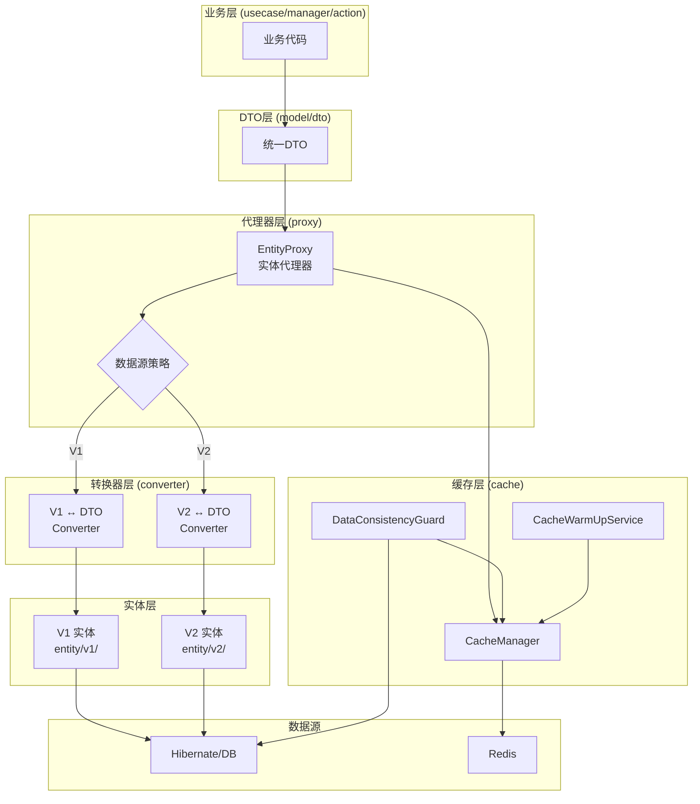
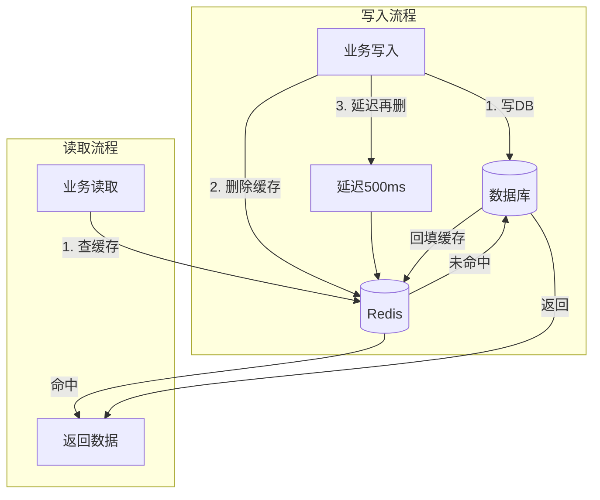
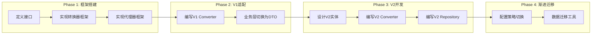

# 壶言经济（HuYanEconomy）实体层重构方案

## 目录

- [一、方案概述](#一方案概述)
- [二、现存问题分析](#二现存问题分析)
- [三、重构目标](#三重构目标)
- [四、整体架构设计](#四整体架构设计)
- [五、目录结构设计](#五目录结构设计)
- [六、核心接口设计](#六核心接口设计)
- [七、DTO层设计](#七dto层设计)
- [八、V2实体设计原则](#八v2实体设计原则)
- [九、Redis缓存方案](#九redis缓存方案)
- [十、数据一致性保障](#十数据一致性保障)
- [十一、迁移路径](#十一迁移路径)
- [十二、方案收益评估](#十二方案收益评估)

---

## 一、方案概述

### 1.1 背景

当前项目的实体层存在以下问题：
- 实体设计混乱，无统一规范
- 实体与业务逻辑高度耦合
- 缺少DTO层，实体直接暴露给业务层
- 版本升级困难，牵一发动全身
- 无缓存层，所有请求直接访问数据库

### 1.2 核心思路

设计一套**"DTO统一 + 版本隔离 + 代理器透明切换 + Redis缓存"**的数据访问架构：

1. **DTO统一**：业务层只使用DTO，不感知底层实体版本
2. **版本隔离**：V1实体保持不动，V2实体全新设计，两者零耦合
3. **代理器透明切换**：通过配置决定使用哪个版本的数据源，业务层无感知
4. **Redis缓存**：热点数据缓存到Redis，提升查询性能

### 1.3 方案优势

- 业务层与实体层完全解耦
- 支持多版本实体并存，平滑迁移
- 未来V3只需新增实体和转换器，配置切换即可
- Redis缓存提升性能，完善的容灾机制

---

## 二、现存问题分析

### 2.1 实体层问题

| 问题 | 现状 | 影响 |
|------|------|------|
| ID不规范 | Int/Long/String混用 | 类型转换频繁，易出错 |
| 关系建模弱 | 字符串字段模拟外键 | 类型安全差，无法利用JPA关联查询 |
| 字段扁平 | 大量基础类型混用 | 语义不清晰，维护困难 |
| 业务逻辑入侵 | 实体包含业务方法 | 职责不单一，测试困难 |
| 表名不规范 | 表名与类名不一致 | 命名混乱，认知负担大 |

### 2.2 架构层问题

| 问题 | 现状 | 影响 |
|------|------|------|
| 实体直接暴露 | usecase/manager直接使用实体 | 层间耦合，修改影响范围大 |
| 缺少DTO层 | 无传输对象 | 无法做数据裁剪和转换 |
| 仓储层不统一 | 部分逻辑绕过仓储层 | 数据访问入口分散 |
| 无缓存层 | 所有请求直接查DB | 性能瓶颈，高并发风险 |

---

## 三、重构目标

### 3.1 短期目标

- [x] 设计DTO层，业务层统一使用DTO
- [x] 设计实体代理器，支持版本透明切换
- [x] 引入Redis缓存，提升查询性能
- [x] 保持V1实体不动，支持平滑迁移

### 3.2 长期目标

- [ ] V2实体全面替换V1
- [x] 完善的数据迁移工具
- [ ] 监控告警体系
- [ ] 支持V3无缝扩展

---

## 四、整体架构设计

### 4.1 架构图



### 4.2 数据流向

**读取流程：**
```
业务层 → DTO → Proxy → CacheManager → Redis(命中) → 返回
                                      → Redis(未命中) → DB → 回填Redis → 返回
```

**写入流程：**
```
业务层 → DTO → Proxy → Converter → Entity → Repository → DB(先写)
                                                    → 删除Redis缓存
                                                    → 延迟再删一次
```

---

## 五、目录结构设计

```
src/main/kotlin/cn/chahuyun/economy/
├── model/                          # DTO层（业务层唯一使用的对象）
│   ├── user/
│   │   ├── UserInfoDto.kt
│   │   ├── UserBackpackDto.kt
│   │   └── UserStatusDto.kt
│   ├── bank/
│   │   ├── BankInfoDto.kt
│   │   └── BankAccountDto.kt
│   ├── fish/
│   │   ├── FishDto.kt
│   │   ├── FishInfoDto.kt
│   │   └── FishPondDto.kt
│   ├── raffle/
│   │   ├── RaffleBatchDto.kt
│   │   └── RaffleRecordDto.kt
│   ├── privatebank/
│   │   ├── PrivateBankDto.kt
│   │   └── ...
│   ├── redpack/
│   │   └── RedPackDto.kt
│   └── props/
│       └── PropsDataDto.kt
│
├── entity/                         # 实体层（按版本隔离）
│   ├── v1/                         # V1实体（现有实体，保持不动）
│   │   ├── UserInfo.kt
│   │   ├── BankInfo.kt
│   │   └── ...
│   └── v2/                         # V2实体（全新设计，与V1完全解耦）
│       ├── user/
│       │   ├── UserEntity.kt
│       │   ├── UserBackpackEntity.kt
│       │   └── UserSignRecord.kt
│       ├── bank/
│       │   ├── BankEntity.kt
│       │   └── BankAccountEntity.kt
│       └── ...
│
├── proxy/                          # 代理器层
│   ├── EntityProxy.kt              # 核心代理器接口
│   ├── EntityProxyImpl.kt          # 代理器实现
│   ├── DataSourceStrategy.kt       # 数据源策略
│   └── module/                     # 按模块的代理器
│       ├── UserEntityProxy.kt
│       ├── BankEntityProxy.kt
│       └── ...
│
├── converter/                      # 转换器层
│   ├── Converter.kt                # 转换器接口
│   ├── v1/                         # V1转换器
│   │   ├── UserV1Converter.kt
│   │   └── ...
│   └── v2/                         # V2转换器
│       ├── UserV2Converter.kt
│       └── ...
│
├── cache/                          # 缓存层
│   ├── CacheManager.kt             # 缓存管理器
│   ├── CacheConfig.kt              # 缓存配置
│   ├── CacheWarmUpService.kt       # 缓存预热服务
│   └── DataConsistencyGuard.kt     # 数据一致性守护
│
└── repository/                     # 仓储层（按版本隔离）
    ├── v1/                         # V1仓储（现有）
    └── v2/                         # V2仓储（全新）
```

---

## 六、核心接口设计

### 6.1 版本枚举与数据源策略

```kotlin
// proxy/DataSourceStrategy.kt

/**
 * 数据源版本
 */
enum class DataVersion {
    V1,     // 现有实体
    V2,     // 新设计实体
    V3,     // 未来预留
    REDIS   // Redis缓存
}

/**
 * 数据源策略配置
 */
interface DataSourceStrategy {
    fun getVersion(module: String): DataVersion
    fun isRedisEnabled(): Boolean
    fun getFallbackChain(module: String): List<DataVersion>
}
```

### 6.2 转换器接口

```kotlin
// converter/Converter.kt

/**
 * 实体-DTO转换器接口
 * @param E 实体类型
 * @param D DTO类型
 */
interface Converter<E, D> {
    fun toDto(entity: E): D
    fun toEntity(dto: D): E
    fun toDtoList(entities: List<E>): List<D> = entities.map { toDto(it) }
    fun toEntityList(dtos: List<D>): List<E> = dtos.map { toEntity(it) }
}
```

### 6.3 实体代理器接口

```kotlin
// proxy/EntityProxy.kt

/**
 * 实体代理器接口
 * 业务层通过此接口访问数据，无需关心底层数据源版本
 */
interface EntityProxy<D> {
    suspend fun findById(id: Long): D?
    suspend fun findAll(): List<D>
    suspend fun findWhere(predicate: (D) -> Boolean): List<D>
    suspend fun save(dto: D): D
    suspend fun saveAll(dtos: List<D>): List<D>
    suspend fun delete(id: Long): Boolean
    fun getCurrentVersion(): DataVersion
    suspend fun migrateTo(targetVersion: DataVersion): MigrationResult
}

data class MigrationResult(
    val success: Boolean,
    val migratedCount: Int,
    val failedCount: Int,
    val errors: List<String>
)
```

---

## 七、DTO层设计

### 7.1 设计原则

- 业务层只使用DTO，不感知底层实体
- DTO可以包含计算属性和业务方法
- DTO支持序列化（用于Redis缓存）
- DTO字段扁平化，方便业务层使用

### 7.2 示例：UserInfoDto

```kotlin
// model/user/UserInfoDto.kt

/**
 * 用户信息DTO
 * 业务层唯一使用的用户数据对象
 */
@Serializable
data class UserInfoDto(
    val id: Long,
    val qq: Long,
    val nickname: String,
    val registerGroup: Long,
    val registerTime: Instant,
    
    // 签到信息（平铺到DTO，方便业务层使用）
    val lastSignTime: Instant?,
    val consecutiveDays: Int,
    val totalSignDays: Int,
    val signEarnings: BigDecimal,
    
    // 背包信息
    val backpackCount: Int,
    
    val createdAt: Instant,
    val updatedAt: Instant
) {
    /**
     * 是否已签到（今日）
     */
    val isSignedToday: Boolean
        get() = lastSignTime?.let {
            val today = LocalDate.now()
            val signDate = it.atZone(ZoneId.systemDefault()).toLocalDate()
            signDate == today
        } ?: false
}
```

---

## 八、V2实体设计原则

### 8.1 设计规范

| 问题 | V1现状 | V2改进 |
|------|--------|--------|
| ID不规范 | Int/Long/String混用 | 统一使用Long自增主键 |
| 关系建模弱 | 字符串字段模拟外键 | 使用真正的JPA关系注解 |
| 字段扁平 | 大量基础类型混用 | 引入值对象（Value Object） |
| 业务逻辑入侵 | 实体包含业务方法 | 纯数据载体，业务逻辑移至usecase |
| 表名不规范 | 表名与类名不一致 | 统一命名规范 `hye_` 前缀 |

### 8.2 示例：UserEntity (V2)

```kotlin
// entity/v2/user/UserEntity.kt

@Entity
@Table(name = "hye_user")
data class UserEntity(
    @Id
    @GeneratedValue(strategy = GenerationType.IDENTITY)
    val id: Long = 0,
    
    @Column(name = "qq", unique = true, nullable = false)
    val qq: Long,
    
    @Column(name = "nickname")
    val nickname: String = "",
    
    @Column(name = "register_group")
    val registerGroup: Long = 0,
    
    @Column(name = "register_time")
    val registerTime: Instant = Instant.now(),
    
    @OneToOne(mappedBy = "user", cascade = [CascadeType.ALL], fetch = FetchType.LAZY)
    val signRecord: UserSignRecord? = null,
    
    @OneToMany(mappedBy = "user", cascade = [CascadeType.ALL], fetch = FetchType.LAZY)
    val backpacks: List<UserBackpackEntity> = emptyList(),
    
    @Column(name = "created_at")
    val createdAt: Instant = Instant.now(),
    
    @Column(name = "updated_at")
    val updatedAt: Instant = Instant.now()
)
```

---

## 九、Redis缓存方案

### 9.1 同步策略：Cache-Aside + 延迟双删



### 9.2 缓存管理器

```kotlin
// cache/CacheManager.kt

class CacheManager(
    private val redis: RedisClient,
    private val config: CacheConfig
) {
    private val delayExecutor = ScheduledThreadPoolExecutor(2)
    
    companion object {
        private const val KEY_PREFIX = "hye:"
        private const val DELAY_DELETE_MS = 500L
    }
    
    /**
     * 从缓存读取，未命中则从DB加载并回填
     */
    suspend fun <T : Any> getOrLoad(
        key: String,
        clazz: KClass<T>,
        loader: suspend () -> T?,
        ttl: Duration = config.defaultTtl
    ): T? {
        val fullKey = "$KEY_PREFIX$key"
        
        // 1. 尝试从Redis获取
        val cached = redis.get(fullKey)
        if (cached != null) {
            return Json.decodeFromString(clazz.serializer(), cached)
        }
        
        // 2. 缓存未命中，从DB加载
        val data = loader()
        
        // 3. 回填缓存
        if (data != null) {
            redis.set(fullKey, Json.encodeToString(clazz.serializer(), data), ttl)
        }
        
        return data
    }
    
    /**
     * 写入数据（延迟双删策略）
     */
    suspend fun <T : Any> writeWithSync(
        key: String,
        clazz: KClass<T>,
        writer: suspend () -> T
    ): T {
        val fullKey = "$KEY_PREFIX$key"
        
        // 1. 写入数据库
        val data = writer()
        
        // 2. 立即删除缓存
        redis.del(fullKey)
        
        // 3. 延迟再删一次
        delayExecutor.schedule({
            runBlocking { redis.del(fullKey) }
        }, DELAY_DELETE_MS, TimeUnit.MILLISECONDS)
        
        return data
    }
}
```

### 9.3 缓存预热

```kotlin
// cache/CacheWarmUpService.kt

class CacheWarmUpService(
    private val cacheManager: CacheManager,
    private val userRepository: UserRepository,
    private val strategy: DataSourceStrategy
) {
    /**
     * 服务启动时执行缓存预热
     */
    suspend fun warmUp() {
        if (!strategy.isRedisEnabled()) return
        
        try {
            // 1. 预热活跃用户（最近7天）
            warmUpActiveUsers()
            
            // 2. 预热全局配置
            warmUpGlobalConfig()
            
            // 3. 预热排行榜
            warmUpRankings()
        } catch (e: Exception) {
            log.error(e) { "缓存预热异常，降级为纯DB模式" }
        }
    }
    
    private suspend fun warmUpActiveUsers() {
        val activeUsers = userRepository.findActiveUsers(7)
        cacheManager.warmUp(
            keys = activeUsers.map { "user:${it.qq}" },
            clazz = UserInfoDto::class,
            batchLoader = { keys ->
                val qqs = keys.map { it.removePrefix("user:").toLong() }
                userRepository.findByQqs(qqs).associateBy { "user:${it.qq}" }
            }
        )
    }
}
```

### 9.4 Redis持久化配置

```conf
# RDB持久化
save 900 1
save 300 10
save 60 10000

# AOF持久化（推荐）
appendonly yes
appendfsync everysec

# 内存限制
maxmemory 256mb
maxmemory-policy allkeys-lru
```

---

## 十、数据一致性保障

### 10.1 核心原则

**数据库是唯一可靠的数据源**，Redis仅作为加速层。

### 10.2 故障场景处理

| 场景 | 处理策略 |
|------|----------|
| Redis写入失败 | 记录日志，不影响业务，后台重试 |
| Redis宕机 | 自动降级为纯DB模式 |
| 服务强制终止 | DB已持久化，重启后一致性检查 |
| 缓存与DB不一致 | 以DB为准，自动修复缓存 |

### 10.3 服务启动一致性检查

```kotlin
// cache/DataConsistencyGuard.kt

class DataConsistencyGuard(
    private val redis: RedisClient,
    private val cacheManager: CacheManager,
    private val strategy: DataSourceStrategy
) {
    /**
     * 服务启动时的数据一致性检查
     */
    suspend fun consistencyCheck() {
        if (!strategy.isRedisEnabled()) return
        
        // 1. 检查Redis连接
        if (!redis.ping()) {
            log.warn { "Redis连接失败，降级为纯DB模式" }
            return
        }
        
        // 2. 检查关键数据是否在缓存中
        val missingKeys = checkCriticalData()
        
        // 3. 补充缺失的缓存数据
        if (missingKeys.isNotEmpty()) {
            reloadMissingData(missingKeys)
        }
    }
}
```

---

## 十一、迁移路径

### 11.1 四阶段迁移



### 11.2 风险控制

- **Phase 1-2**：纯新增代码，零风险
- **Phase 3**：V2实体独立开发，不影响现有功能
- **Phase 4**：通过配置切换，可随时回滚到V1

### 11.3 Phase 4 commands

Phase 4 provides explicit migration, switch, and rollback commands:

```bash
# Show current module data versions
hye entity-version

# Migrate all modules from V1 to V2 and switch successful modules to V2
hye migrate-v2

# Migrate one module from V1 to V2 and switch it to V2 after success
hye migrate-v2 user

# Switch without copying data, useful after manual validation
hye entity-switch all V2
hye entity-switch user V2

# Roll back routing to V1 without deleting V2 data
hye rollback-v1
hye rollback-v1 user
```

Module versions are persisted in `PluginConfig.entityDataVersions`. Missing modules use V1 by default, so rollback removes V2 routing from the config instead of deleting data.

---

## 十二、方案收益评估

### 12.1 架构收益

| 维度 | 提升幅度 | 说明 |
|------|----------|------|
| 代码可维护性 | ⭐⭐⭐⭐⭐ | 分层清晰，各层独立演进 |
| 版本升级能力 | ⭐⭐⭐⭐⭐ | DTO隔离，版本切换无感 |
| 代码质量 | ⭐⭐⭐⭐ | 职责单一，易于测试 |

### 12.2 性能收益

| 场景 | 提升倍数 | 说明 |
|------|----------|------|
| 查询用户信息 | 10-50倍 | Redis命中，毫秒级响应 |
| 批量查询排行榜 | 20-50倍 | 缓存热点数据 |
| 高并发场景 | 5-10倍 | Redis抗压，DB异步写入 |

### 12.3 开发效率收益

| 场景 | 提升前 | 提升后 |
|------|--------|--------|
| 新增字段 | 修改实体+所有引用处 | 修改实体+Converter |
| 版本升级 | 全量代码修改 | 新增实体+配置切换 |
| 新人上手 | 理解整个实体关系 | 只需理解DTO接口 |

