# 壶言经济（HuYanEconomy）数据库设计

## 目录

- [一、数据库概述](#一数据库概述)
- [二、核心实体关系图](#二核心实体关系图)
- [三、用户相关表](#三用户相关表)
- [四、银行相关表](#四银行相关表)
- [五、私人银行相关表](#五私人银行相关表)
- [六、钓鱼相关表](#六钓鱼相关表)
- [七、抢劫相关表](#七抢劫相关表)
- [八、红包相关表](#八红包相关表)
- [九、抽奖相关表](#九抽奖相关表)
- [十、道具相关表](#十道具相关表)
- [十一、称号相关表](#十一称号相关表)
- [十二、全局配置表](#十二全局配置表)
- [十三、数据迁移与修复](#十三数据迁移与修复)

---

## 一、数据库概述

### 技术选型

- **ORM 框架**：Hibernate 6.x（通过 mirai-hibernate-plugin 运行时提供）
- **实体注解**：`jakarta.persistence`（JPA 3.0）
- **支持数据库**：H2、SQLite、MySQL
- **DDL 策略**：自动建表（Hibernate auto DDL）

### 实体类位置

所有实体类位于 `cn.chahuyun.economy.entity` 包下，HibernateUtil 初始化时扫描此包。

### 命名约定

| 类型 | 约定 | 示例 |
|------|------|------|
| 表名 | PascalCase 或 snake_case | `UserInfo` / `user_status` |
| 主键 | `id` | `var id: Long? = null` |
| 外键 | 实体引用或 ID 字段 | `var qq: Long = 0` |
| 时间 | `java.util.Date` | `var createdAt: Date = Date()` |
| 索引 | `idx_` 前缀 | `idx_pb_deposit_bank_user` |

---

## 二、核心实体关系图

```mermaid
erDiagram
    UserInfo ||--o| UserProperty : "qq"
    UserInfo ||--o| UserStatus : "qq"
    UserInfo ||--o| UserFactor : "qq"
    UserInfo ||--o| UserRaffle : "qq"
    UserInfo ||--o| FishInfo : "qq"
    UserInfo ||--o| RobInfo : "userId"
    UserInfo ||--o{ TitleInfo : "userId"
    UserInfo ||--o{ UserBackpack : "userId"

    BankInfo ||--o{ PrivateBankDeposit : "code"
    PrivateBank ||--o{ PrivateBankDeposit : "code"
    PrivateBank ||--o{ PrivateBankLoan : "code"
    PrivateBank ||--o{ PrivateBankLoanOffer : "code"
    PrivateBank ||--o{ PrivateBankReview : "code"
    PrivateBank ||--o{ PrivateBankFoxBondBid : "code"

    PrivateBankFoxBond ||--o{ PrivateBankFoxBondBid : "code"
    PrivateBankFoxBond ||--o{ PrivateBankFoxBondHolding : "code"
    PrivateBankGovBondIssue ||--o{ PrivateBankGovBondHolding : "id"

    FishPond ||--o{ Fish : "pond_id"
    FishPond ||--o{ FishRanking : "FishPondId"
    Fish ||--o{ FishRanking : "FishId"

    RaffleBatch ||--o{ RaffleRecord : "batch_id"
```



---

## 三、用户相关表

### 3.1 UserInfo — 用户信息表

**实体类**：`cn.chahuyun.economy.entity.UserInfo`

| 字段 | 类型 | 约束 | 说明 |
|------|------|------|------|
| `id` | String | PK | 主键（用户唯一标识） |
| `qq` | Long | | 用户 QQ 号 |
| `name` | String | | 用户昵称 |
| `registerGroup` | Long | | 注册群号 |
| `registerTime` | Date | | 注册时间 |
| `sign` | Boolean | | 今日是否已签到 |
| `signTime` | Date | | 最后签到时间 |
| `signNum` | Int | | 连续签到次数 |
| `totalSignNum` | Int | | 累计签到次数 |
| `money` | Double | | 钱包余额 |
| `bankMoney` | Double | | 银行存款 |

**业务说明**：
- 用户首次使用任意功能时自动创建
- `sign` 字段在每日 `reSignTime` 时间后重置为 `false`
- `money` 为钱包中的可用金币，`bankMoney` 为主银行存款

### 3.2 UserProperty — 用户资产表

**实体类**：`cn.chahuyun.economy.entity.UserProperty`

| 字段 | 类型 | 约束 | 说明 |
|------|------|------|------|
| `id` | Long | PK | 主键（用户 QQ 号） |

**业务说明**：
- 记录用户扩展资产信息
- 与 UserInfo 一一对应

### 3.3 UserStatus — 用户状态表

**实体类**：`cn.chahuyun.economy.entity.UserStatus`

| 字段 | 类型 | 约束 | 说明 |
|------|------|------|------|
| `id` | Long | PK | 主键（用户 QQ 号） |
| `place` | UserLocation (enum) | | 用户所处位置 |
| `recoveryTime` | Int | | 复原时间（分钟） |
| `startTime` | Date | | 状态开始时间 |

**UserLocation 枚举值**：

| 值 | 显示名 | 说明 |
|----|--------|------|
| `HOME` | 家 | 默认状态 |
| `HOSPITAL` | 医院 | 受伤恢复中 |
| `PRISON` | 监狱 | 被关押中 |
| `FISHPOND` | 鱼塘 | 正在钓鱼 |
| `FACTORY` | 工厂 | 工作中 |
| `OTHER1`~`OTHER6` | 其他 | 扩展位置 |

### 3.4 UserFactor — 用户因子表

**实体类**：`cn.chahuyun.economy.entity.UserFactor`

| 字段 | 类型 | 约束 | 说明 |
|------|------|------|------|
| `id` | Long | PK | 主键（用户 QQ 号） |
| `irritable` | Double | | 暴躁值（默认 0.3） |
| `force` | Double | | 武力值（默认 0.1），抢劫成功附加概率 |
| `dodge` | Double | | 闪避值（默认 0.1），闪避/逃跑概率 |
| `resistance` | Double | | 反抗因子（默认 0.3） |
| `buff` | String | | Buff 列表（JSON 存储） |

**业务说明**：
- 因子影响抢劫、战斗等系统的概率计算
- `buff` 字段以 JSON 数组格式存储临时增益效果

### 3.5 UserBackpack — 用户背包表

**实体类**：`cn.chahuyun.economy.entity.UserBackpack`

| 字段 | 类型 | 约束 | 说明 |
|------|------|------|------|
| `id` | Long | PK (AUTO) | 主键 |
| `userId` | String | | 用户标识 |
| `propCode` | String | | 道具编码 |
| `propKind` | String | | 道具类型（CARD / F_PROP / FISH_BAIT） |
| `propId` | Long | | 道具数据 ID（关联 PropsData） |

### 3.6 UserRaffle — 用户抽奖信息表

**实体类**：`cn.chahuyun.economy.entity.UserRaffle`

| 字段 | 类型 | 约束 | 说明 |
|------|------|------|------|
| `id` | Long | PK | 主键（用户 QQ 号） |
| `defaultPool` | String | | 默认抽奖池 |
| `times` | Int | | 总抽奖次数 |
| `jackpot` | Int | | 总头奖次数 |

**关联表**：`user_raffle_pool_times`

| 字段 | 类型 | 说明 |
|------|------|------|
| `user_id` | Long | 用户 ID（外键） |
| `pool_name` | String | 抽奖池名称 |
| `times` | Int | 该池的抽奖次数 |

---

## 四、银行相关表

### 4.1 BankInfo — 银行信息表

**实体类**：`cn.chahuyun.economy.entity.bank.BankInfo`

| 字段 | 类型 | 约束 | 说明 |
|------|------|------|------|
| `id` | Int | PK (AUTO) | 主键 |
| `code` | String | | 银行唯一编码 |
| `name` | String | | 银行名称 |
| `description` | String | | 银行描述 |
| `qq` | Long | | 银行管理者 QQ |
| `interestSwitch` | Boolean | | 是否每周随机利率 |
| `regTime` | Date | | 注册时间 |
| `regTotal` | Double | | 注册金额 |
| `total` | Double | | 银行总金额 |
| `interest` | Int | | 银行利率（i%，日利率 = interest/1000） |

**利率机制**：
- 利率范围：-10 到 30
- 概率分布：
  - 1% 概率：利率 20-30
  - 4% 概率：利率 10-20
  - 15% 概率：利率 1-10
  - 40% 概率：利率 0
  - 20% 概率：利率 -3 到 -1
  - 15% 概率：利率 -10 到 -3
  - 5% 概率：利率 -20 到 -10

---

## 五、私人银行相关表

### 5.1 PrivateBank — 私人银行表

**实体类**：`cn.chahuyun.economy.entity.privatebank.PrivateBank`

| 字段 | 类型 | 约束 | 说明 |
|------|------|------|------|
| `id` | Int | PK (AUTO) | 主键 |
| `code` | String | UNIQUE | 银行唯一编码 |
| `name` | String | | 银行名称 |
| `slogan` | String | | 银行口号 |
| `ownerQq` | Long | | 行长 QQ |
| `vipOnly` | Boolean | | 是否仅 VIP 可存入 |
| `vipWhitelist` | String (LOB) | | VIP 白名单（逗号分隔） |
| `depositorInterest` | Int | | 给储户的日利率（默认 5） |
| `createdAt` | Date | | 创建时间 |
| `defaulterUntil` | Date | | 失信截止时间（不为空且未过期 = 失信） |
| `withdrawRequests` | Int | | 取款请求数 |
| `withdrawFailures` | Int | | 取款失败数 |
| `star` | Int | | 星级（1-5） |
| `avgReview` | Double | | 平均评分（1-5） |

### 5.2 PrivateBankDeposit — 存款记录表

**实体类**：`cn.chahuyun.economy.entity.privatebank.PrivateBankDeposit`

| 字段 | 类型 | 约束 | 说明 |
|------|------|------|------|
| `id` | Int | PK (AUTO) | 主键 |
| `bankCode` | String | UNIQUE INDEX (bankCode+userQq) | 银行编码 |
| `userQq` | Long | UNIQUE INDEX (bankCode+userQq) | 用户 QQ |
| `principal` | Double | | 当前本金（含利息累积） |
| `createdAt` | Date | | 创建时间 |
| `updatedAt` | Date | | 更新时间 |

**索引**：`idx_pb_deposit_bank_user`（bankCode + userQq, UNIQUE）

### 5.3 PrivateBankLoan — 贷款记录表

**实体类**：`cn.chahuyun.economy.entity.privatebank.PrivateBankLoan`

| 字段 | 类型 | 约束 | 说明 |
|------|------|------|------|
| `id` | Int | PK (AUTO) | 主键 |
| `offerId` | Int | | 对应的贷款标的 ID |
| `bankCode` | String | | 银行编码 |
| `lenderQq` | Long | | 贷方（银行/行长）QQ |
| `borrowerQq` | Long | | 借方 QQ |
| `principal` | Double | | 本金 |
| `dueTotal` | Double | | 应还总额（本金+利息，发放时计算） |
| `repaidAmount` | Double | | 已还金额（支持部分还款） |
| `interest` | Int | | 利率 |
| `termDays` | Int | | 贷款期限（天，默认 7） |
| `createdAt` | Date | | 创建时间 |
| `dueAt` | Date | | 到期时间 |
| `repaidAt` | Date | | 还清时间 |

### 5.4 PrivateBankLoanOffer — 贷款标的表

**实体类**：`cn.chahuyun.economy.entity.privatebank.PrivateBankLoanOffer`

| 字段 | 类型 | 约束 | 说明 |
|------|------|------|------|
| `id` | Int | PK (AUTO) | 主键 |
| `bankCode` | String | | 银行编码 |
| `ownerQq` | Long | | 发布者 QQ |
| `source` | String | | 资金来源：LIQUIDITY / OWNER |
| `total` | Double | | 总金额 |
| `remaining` | Double | | 剩余可贷金额 |
| `interest` | Int | | 利率 |
| `termDays` | Int | | 贷款期限（天） |
| `enabled` | Boolean | | 是否启用 |
| `createdAt` | Date | | 创建时间 |

### 5.5 PrivateBankReview — 银行评分表

**实体类**：`cn.chahuyun.economy.entity.privatebank.PrivateBankReview`

| 字段 | 类型 | 约束 | 说明 |
|------|------|------|------|
| `id` | Int | PK (AUTO) | 主键 |
| `bankCode` | String | INDEX | 银行编码 |
| `userQq` | Long | | 评分用户 QQ |
| `rating` | Int | | 评分（1-5） |
| `content` | String (LOB) | | 评价文本 |
| `createdAt` | Date | | 评价时间 |

### 5.6 PrivateBankFoxBond — 狐卷表

**实体类**：`cn.chahuyun.economy.entity.privatebank.PrivateBankFoxBond`

| 字段 | 类型 | 约束 | 说明 |
|------|------|------|------|
| `id` | Int | PK (AUTO) | 主键 |
| `code` | String | UNIQUE | 狐卷唯一编码 |
| `faceValue` | Double | | 面额 |
| `baseRate` | Double | | 原始固定日利（百分比，如 3.2 = 3.2%/day） |
| `termDays` | Int | | 期限（天，默认 14） |
| `bidStartAt` | Date | | 竞标开始时间 |
| `bidEndAt` | Date | | 竞标截止时间 |
| `status` | String | | 状态：BIDDING / HOLDING / FINISHED / CANCELLED |
| `winnerBankCode` | String | | 中标银行编码 |
| `winnerBidRate` | Double | | 中标利率 |
| `winnerPremium` | Double | | 中标溢价 |
| `createdAt` | Date | | 创建时间 |

**索引**：`idx_pb_foxbond_status`（status）、`idx_pb_foxbond_bidEndAt`（bidEndAt）

**狐卷生命周期**：
```
BIDDING（竞标中）→ HOLDING（持有中）→ FINISHED（已到期）
                                     → CANCELLED（已取消）
```

### 5.7 PrivateBankFoxBondBid — 狐卷竞标记录表

**实体类**：`cn.chahuyun.economy.entity.privatebank.PrivateBankFoxBondBid`

| 字段 | 类型 | 约束 | 说明 |
|------|------|------|------|
| `id` | Int | PK (AUTO) | 主键 |
| `bondCode` | String | INDEX | 狐卷编码 |
| `bankCode` | String | UNIQUE (bondCode+bankCode) | 竞标银行编码 |
| `ownerQq` | Long | | 竞标者 QQ |
| `premium` | Double | | 溢价金额（中标即扣除） |
| `bidRate` | Double | | 接受的日利率（百分比） |
| `createdAt` | Date | | 竞标时间 |

### 5.8 PrivateBankFoxBondHolding — 狐卷持仓表

**实体类**：`cn.chahuyun.economy.entity.privatebank.PrivateBankFoxBondHolding`

| 字段 | 类型 | 约束 | 说明 |
|------|------|------|------|
| `id` | Int | PK (AUTO) | 主键 |
| `bondCode` | String | | 狐卷编码 |
| `bankCode` | String | INDEX | 持有银行编码 |
| `principal` | Double | | 锁定面额 |
| `rate` | Double | | 实际日利率（百分比） |
| `startedAt` | Date | | 持有开始时间 |
| `dueAt` | Date | | 到期时间 |
| `redeemedAt` | Date | INDEX | 赎回时间 |

### 5.9 PrivateBankGovBondIssue — 国卷发行表

**实体类**：`cn.chahuyun.economy.entity.privatebank.PrivateBankGovBondIssue`

| 字段 | 类型 | 约束 | 说明 |
|------|------|------|------|
| `id` | Int | PK (AUTO) | 主键 |
| `weekKey` | String | UNIQUE | 周标识（如 2026-W03） |
| `rateMultiplier` | Double | | 利率倍数（相对主银行利率，默认 2.0） |
| `lockDays` | Int | | 锁仓天数（默认 3） |
| `totalLimit` | Double | | 总额度 |
| `remaining` | Double | | 剩余额度 |
| `createdAt` | Date | | 创建时间 |

### 5.10 PrivateBankGovBondHolding — 国卷持仓表

**实体类**：`cn.chahuyun.economy.entity.privatebank.PrivateBankGovBondHolding`

| 字段 | 类型 | 约束 | 说明 |
|------|------|------|------|
| `id` | Int | PK (AUTO) | 主键 |
| `bankCode` | String | | 持有银行编码 |
| `issueId` | Int | | 发行 ID |
| `principal` | Double | | 持有面额 |
| `rateMultiplier` | Double | | 利率倍数 |
| `lockDays` | Int | | 锁仓天数 |
| `boughtAt` | Date | | 购买时间 |
| `redeemedAt` | Date | | 赎回时间 |

---

## 六、钓鱼相关表

### 6.1 Fish — 鱼类表

**实体类**：`cn.chahuyun.economy.entity.fish.Fish`

| 字段 | 类型 | 约束 | 说明 |
|------|------|------|------|
| `id` | Int | PK (AUTO) | 主键 |
| `level` | Int | | 鱼的等级 |
| `name` | String | | 鱼的名称 |
| `description` | String | | 鱼的描述 |
| `price` | Int | | 单价 |
| `dimensionsMin` | Int | | 最小尺寸 |
| `dimensionsMax` | Int | | 最大尺寸 |
| `dimensions1`~`dimensions4` | Int | | 尺寸分位数（用于随机分布） |
| `difficulty` | Int | | 难度 |
| `special` | Boolean | | 是否特殊鱼（彩蛋鱼） |

### 6.2 FishInfo — 钓鱼信息表

**实体类**：`cn.chahuyun.economy.entity.fish.FishInfo`

| 字段 | 类型 | 约束 | 说明 |
|------|------|------|------|
| `id` | Long | PK | 主键（用户 QQ 号） |
| `qq` | Long | | 用户 QQ 号 |
| `isFishRod` | Boolean | | 是否拥有鱼竿 |
| `status` | Boolean | | 是否正在钓鱼 |
| `rodLevel` | Int | | 鱼竿等级 |
| `defaultFishPond` | String | | 默认鱼塘编码 |

### 6.3 FishPond — 鱼塘表

**实体类**：`cn.chahuyun.economy.entity.fish.FishPond`

| 字段 | 类型 | 约束 | 说明 |
|------|------|------|------|
| `id` | Int | PK (AUTO) | 主键 |
| `code` | String | | 鱼塘编码 |
| `admin` | Long | | 管理者 QQ |
| `pondType` | Int | | 鱼塘类型（1=群鱼塘, 2=私人鱼塘, 3=全局鱼塘） |
| `name` | String | | 鱼塘名称 |
| `description` | String | | 鱼塘描述 |
| `pondLevel` | Int | | 鱼塘等级 |
| `minLevel` | Int | | 最低进入等级 |
| `rebate` | Double | | 卖鱼回扣比例（默认 0.05） |
| `number` | Int | | 总钓鱼次数 |
| `fishList` | List\<Fish\> | | 鱼塘中的鱼（OneToMany） |

**鱼塘等级**：

| 等级 | 升级费用 | 最低鱼等级 |
|------|----------|-----------|
| LV_2 | 5,000 | 0 |
| LV_3 | 10,000 | 0 |
| LV_4 | 15,000 | 0 |
| LV_5 | 20,000 | 0 |
| LV_6 | 25,000 | 0 |
| LV_7 | 30,000 | 0 |
| LV_8 | 50,000 | 10 |
| LV_9 | 70,000 | 20 |
| LV_10 | 100,000 | 30 |

### 6.4 FishRanking — 钓鱼排行表

**实体类**：`cn.chahuyun.economy.entity.fish.FishRanking`

| 字段 | 类型 | 约束 | 说明 |
|------|------|------|------|
| `id` | Int | PK (AUTO) | 主键 |
| `qq` | Long | | 钓到者 QQ |
| `name` | String | | 鱼的名称 |
| `dimensions` | Int | | 鱼的尺寸 |
| `money` | Double | | 鱼的价值 |
| `fishRodLevel` | Int | | 钓到时的鱼竿等级 |
| `date` | Date | | 钓到时间 |
| `fish` | Fish | | 鱼的引用（ManyToOne） |
| `fishPond` | FishPond | | 鱼塘引用（ManyToOne） |

---

## 七、抢劫相关表

### 7.1 RobInfo — 抢劫信息表

**实体类**：`cn.chahuyun.economy.entity.rob.RobInfo`

| 字段 | 类型 | 约束 | 说明 |
|------|------|------|------|
| `userId` | Long | PK | 主键（用户 QQ 号） |
| `nowTime` | Date | | 最后抢劫时间 |
| `beRobNumber` | Int | | 被抢劫次数 |
| `robSuccess` | Int | | 抢劫成功次数 |
| `hitSuccess` | Int | | 打人成功次数 |

---

## 八、红包相关表

### 8.1 RedPack — 红包表

**实体类**：`cn.chahuyun.economy.entity.redpack.RedPack`

| 字段 | 类型 | 约束 | 说明 |
|------|------|------|------|
| `id` | Int | PK (AUTO) | 主键 |
| `name` | String | | 红包名称 |
| `groupId` | Long | | 所在群号 |
| `sender` | Long | | 发送者 QQ |
| `money` | Double | | 红包总金额 |
| `number` | Int | | 红包个数 |
| `createTime` | Date | | 创建时间 |
| `type` | RedPackType (enum) | | 红包类型 |
| `password` | String | | 口令（仅口令红包） |
| `takenMoneys` | Double | | 已领走的金额 |
| `receivers` | String | | 领取者列表（逗号分隔） |
| `randomRedPack` | String | | 随机金额列表（逗号分隔） |

**RedPackType 枚举**：

| 值 | 说明 |
|----|------|
| `NORMAL` | 普通红包（平均分配） |
| `RANDOM` | 随机红包（随机金额） |
| `PASSWORD` | 口令红包（需输入正确口令） |

---

## 九、抽奖相关表

### 9.1 LotteryInfo — 彩票信息表

**实体类**：`cn.chahuyun.economy.entity.LotteryInfo`

| 字段 | 类型 | 约束 | 说明 |
|------|------|------|------|
| `id` | Int | PK (AUTO) | 主键 |
| `qq` | Long | | 购买用户 QQ |
| `group` | Long | | 购买群号 |
| `money` | Double | | 购买金额 |
| `type` | Int | | 彩票类型（1=小签, 2=中签, 3=大签） |
| `number` | String | | 购买号码 |
| `current` | String | | 本期开奖号码 |
| `bonus` | Double | | 获得奖金 |

### 9.2 RaffleBatch — 抽奖批次表

**实体类**：`cn.chahuyun.economy.entity.raffle.RaffleBatch`

| 字段 | 类型 | 约束 | 说明 |
|------|------|------|------|
| `id` | Long | PK (AUTO) | 主键 |
| `userId` | Long | | 用户 QQ |
| `groupId` | Long | | 群号 |
| `poolId` | String | | 抽奖池 ID |
| `raffleType` | RaffleType (enum) | | 抽奖类型（SINGLE / TEN） |
| `createTime` | Date | | 抽奖时间 |
| `records` | List\<RaffleRecord\> | | 抽奖明细（OneToMany） |

### 9.3 RaffleRecord — 抽奖明细表

**实体类**：`cn.chahuyun.economy.entity.raffle.RaffleRecord`

| 字段 | 类型 | 约束 | 说明 |
|------|------|------|------|
| `id` | Long | PK (AUTO) | 主键 |
| `batch` | RaffleBatch | | 所属批次（ManyToOne） |
| `prizeId` | String | | 奖品 ID |
| `prizeName` | String | | 奖品名称 |
| `level` | Int | | 奖品等级 |

---

## 十、道具相关表

### 10.1 PropsData — 道具数据表

**实体类**：`cn.chahuyun.economy.entity.props.PropsData`

| 字段 | 类型 | 约束 | 说明 |
|------|------|------|------|
| `id` | Long | PK (AUTO) | 主键 |
| `kind` | String | | 道具大类（CARD / F_PROP / FISH_BAIT） |
| `code` | String | | 道具编码 |
| `num` | Int | | 数量（默认 1） |
| `expiredTime` | Date | | 过期时间 |
| `status` | Boolean | | 状态（是否已激活，默认 false） |
| `data` | String (LOB) | | 扩展数据（JSON 存储） |

**存储模式**：混合存储 — 核心字段提取为列，扩展数据保留 JSON。

---

## 十一、称号相关表

### 11.1 TitleInfo — 称号信息表

**实体类**：`cn.chahuyun.economy.entity.TitleInfo`

| 字段 | 类型 | 约束 | 说明 |
|------|------|------|------|
| `id` | Int | PK (AUTO) | 主键 |
| `userId` | Long | | 所属用户 QQ |
| `code` | String | | 称号类型编码 |
| `name` | String | | 称号名称 |
| `status` | Boolean | | 是否正在使用 |
| `title` | String | | 称号显示文本 |
| `impactName` | Boolean | | 是否影响签到图片昵称 |
| `gradient` | Boolean | | 是否渐变色 |
| `sColor` | String | | 起始颜色（十六进制） |
| `eColor` | String | | 结束颜色（十六进制） |
| `dueTime` | Date | | 到期时间（null = 永久） |

---

## 十二、全局配置表

### 12.1 GlobalFactor — 全局因子表

**实体类**：`cn.chahuyun.economy.entity.GlobalFactor`

| 字段 | 类型 | 约束 | 说明 |
|------|------|------|------|
| `id` | Int | PK (AUTO) | 主键 |
| `robFactor` | Double | | 基础抢劫成功概率（默认 0.4） |
| `robBlankFactor` | Double | | 抢劫银行成功概率（默认 0.01） |

---

## 十三、数据迁移与修复

### 自动建表

插件启动时，Hibernate 会根据实体类自动创建/更新数据库表结构。

### 版本升级修复

当实体类结构发生变更时：

1. 更新插件版本
2. 启动 mirai-console
3. 执行 `hye repair` 命令
4. 修复逻辑在 `repair/Repair` 中实现

### 手动迁移

如需手动迁移数据：

1. 备份数据库
2. 使用数据库工具（如 DBeaver）连接数据库
3. 执行 SQL 迁移脚本
4. 验证数据完整性

### 数据库文件位置

| 数据库 | 文件位置 |
|--------|----------|
| H2 | `data/cn.chahuyun.HuYanEconomy/HuYanEconomy.h2.mv.db` |
| SQLite | `data/cn.chahuyun.HuYanEconomy/HuYanEconomy` |
| MySQL | 远程数据库服务器 |

---

## 相关文档

- [项目结构说明](项目结构说明.md)
- [配置说明](配置说明.md)
- [项目功能设计说明](项目功能设计说明.md)
- [FAQ](FAQ.md)

