# 壶言经济（HuYanEconomy）项目功能设计说明

## 目录

- [一、系统总览](#一系统总览)
- [二、用户系统](#二用户系统)
- [三、签到系统](#三签到系统)
- [四、银行系统](#四银行系统)
- [五、私人银行系统](#五私人银行系统)
- [六、钓鱼系统](#六钓鱼系统)
- [七、抢劫系统](#七抢劫系统)
- [八、红包系统](#八红包系统)
- [九、抽奖系统](#九抽奖系统)
- [十、道具系统](#十道具系统)
- [十一、称号系统](#十一称号系统)
- [十二、转账系统](#十二转账系统)
- [十三、定时任务系统](#十三定时任务系统)

---

## 一、系统总览

### 1.1 功能模块关系图

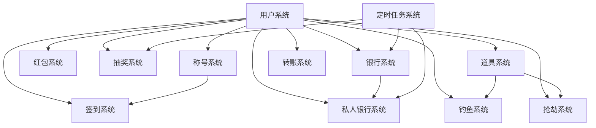

### 1.2 核心数据流

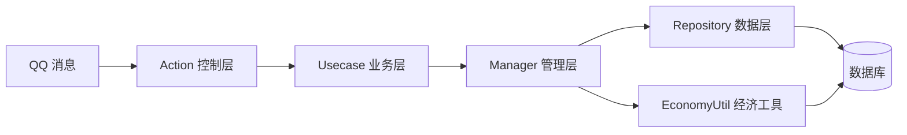

### 1.3 经济货币体系

壶言经济使用单一货币 — **金币**：

| 位置 | 字段 | 说明 |
|------|------|------|
| 钱包 | `UserInfo.money` | 可用余额，用于交易、购买 |
| 主银行 | `UserInfo.bankMoney` | 存在主银行的金币，有利息 |
| 私人银行存款 | `PrivateBankDeposit.principal` | 存在私人银行的金币 |
| 银行总金 | `BankInfo.total` | 银行金库总额 |

金币流转路径：
```
签到 → 钱包
钓鱼 → 钱包
钱包 ↔ 主银行（存款/取款）
钱包 ↔ 私人银行（存款/取款）
钱包 → 道具商店（购买）
钱包 → 其他用户（转账/红包）
抢劫 → 钱包（从他人获取/被他人抢走）
```

---

## 二、用户系统

### 2.1 设计概述

用户系统是所有模块的基础，负责管理用户的基础信息、资产状态和行为记录。

### 2.2 数据模型

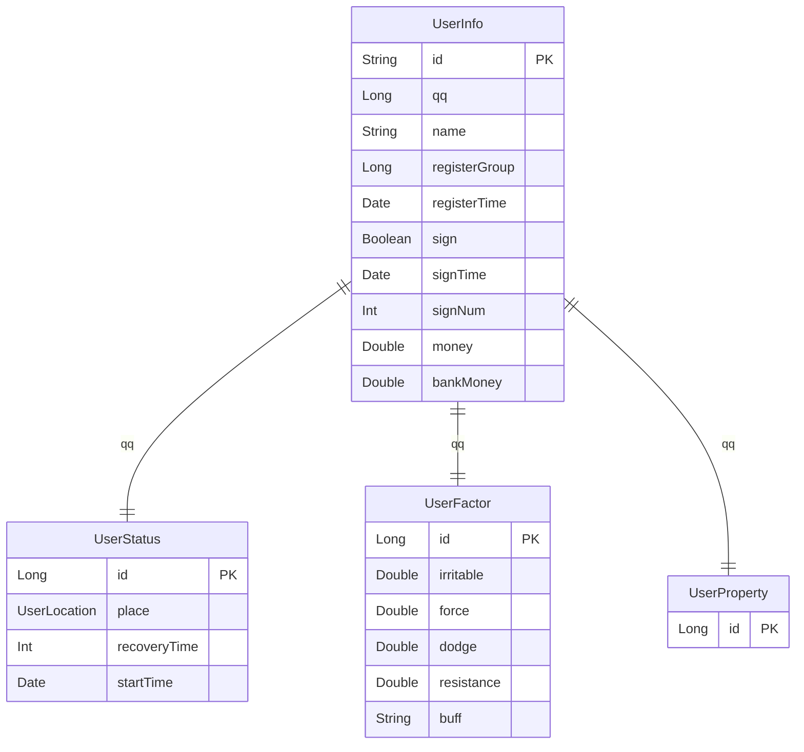

### 2.3 用户位置状态

用户在不同场景下会处于不同位置，影响可用功能：

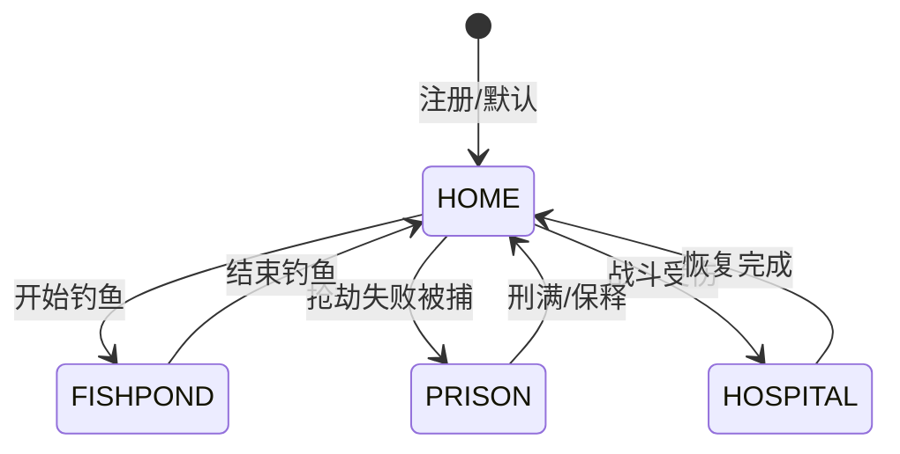

| 位置 | 可用功能 | 禁用功能 |
|------|----------|----------|
| 家（HOME） | 所有功能 | 无 |
| 鱼塘（FISHPOND） | 钓鱼相关 | 部分外出功能 |
| 监狱（PRISON） | 释放出狱 | 大部分功能 |
| 医院（HOSPITAL） | 无 | 大部分功能 |

### 2.4 用户因子系统

用户因子影响各种概率计算：

| 因子 | 默认值 | 影响范围 |
|------|--------|----------|
| 暴躁值（irritable） | 0.3 | 被抢劫时的反抗概率 |
| 武力值（force） | 0.1 | 抢劫成功附加概率 |
| 闪避值（dodge） | 0.1 | 各种场景的闪避/逃跑概率 |
| 反抗因子（resistance） | 0.3 | 被攻击时的反击概率 |

---

## 三、签到系统

### 3.1 设计概述

签到系统是用户获取金币的基础途径，每日可签到一次，获得随机金币奖励。

### 3.2 业务流程

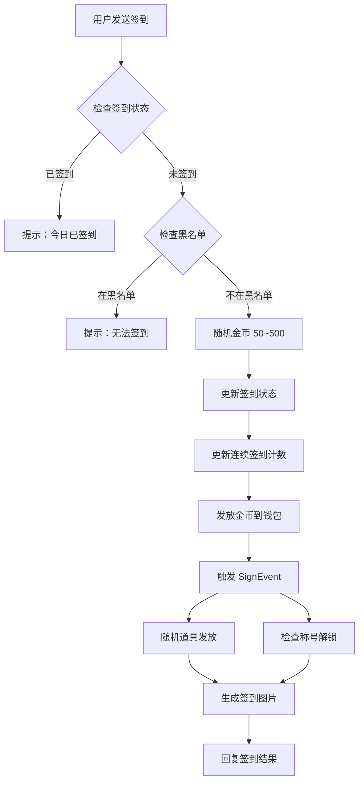

### 3.3 签到规则

| 规则 | 说明 |
|------|------|
| 每日次数 | 1 次 |
| 金币范围 | 50~500（随机） |
| 刷新时间 | 配置 `reSignTime`（默认凌晨 4 点） |
| 连续签到 | 每日签到递增，中断后重置 |
| 图片签到 | 包含头像、昵称、金币、银行余额等信息 |
| 道具掉落 | 签到时有概率获得随机道具 |
| 称号解锁 | 连续签到 15 天/90 天解锁特殊称号 |

### 3.4 签到图片布局

签到图片使用 Apache POI + Java AWT 绘制，包含以下区域：

| 区域 | 坐标 | 内容 |
|------|------|------|
| 头像 | (60, 70) | 用户 QQ 头像 |
| QQ 号 | (230, 100) | 用户 QQ 号 |
| 称号 | (230, 135) | 当前称号（可渐变色） |
| 昵称 | (230, 200) | 用户昵称（可被称号替换） |
| 签到时间 | (180, 340) | 签到时间 |
| 签到次数 | (180, 385) | 连续签到天数 |
| 一言 | (556, 315) | 随机一言文案 |
| 钱包余额 | (118, 530) | 当前钱包金币 |
| 获得金币 | (358, 530) | 本次签到获得 |
| 银行存款 | (585, 530) | 银行存款余额 |
| 银行利率 | (858, 530) | 当前银行利率 |

### 3.5 关键类

| 类 | 职责 |
|----|------|
| `SignAction` | 签到指令入口 |
| `SignUsecase` | 签到业务逻辑 |
| `SignManager` | 签到管理（随机金币、道具发放） |
| `SignEvent` | 签到自定义事件 |

---

## 四、银行系统

### 4.1 设计概述

银行系统提供金币存储和利息功能，是经济系统的基础设施。

### 4.2 业务流程

#### 存款流程

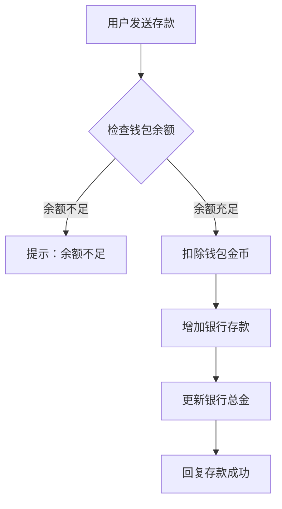

#### 取款流程


### 4.3 利率机制

| 项目 | 说明 |
|------|------|
| 利率范围 | -20 到 30 |
| 结算周期 | 每周 |
| 利率变化 | 可选每周随机 |
| 结算公式 | 利息 = 存款 × (利率 / 1000) × 7 |

**利率概率分布**：

| 利率区间 | 概率 | 说明 |
|----------|------|------|
| 20 ~ 30 | 1% | 极高利率 |
| 10 ~ 20 | 4% | 高利率 |
| 1 ~ 10 | 15% | 正利率 |
| 0 | 40% | 零利率 |
| -3 ~ -1 | 20% | 轻微负利率 |
| -10 ~ -3 | 15% | 负利率 |
| -20 ~ -10 | 5% | 严重负利率 |

### 4.4 富豪榜

富豪榜展示群内用户的财富排名，包含：

- 钱包余额
- 银行存款
- 银行总额占比
- 总资产排名

### 4.5 关键类

| 类 | 职责 |
|----|------|
| `BankAction` | 银行指令入口 |
| `BankUsecase` | 银行业务逻辑 |
| `BankManager` | 银行模块管理 |
| `BankTaskManager` | 银行定时任务（利息结算） |

---

## 五、私人银行系统

### 5.1 设计概述

私人银行系统是一个完整的微型金融生态，允许用户创建银行、吸收存款、发放贷款、参与债券竞标。

### 5.2 系统架构

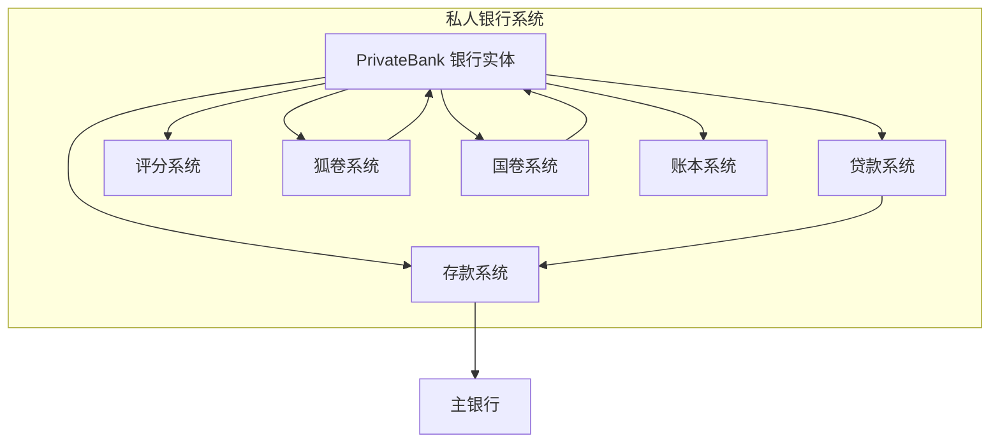

### 5.3 银行创建流程

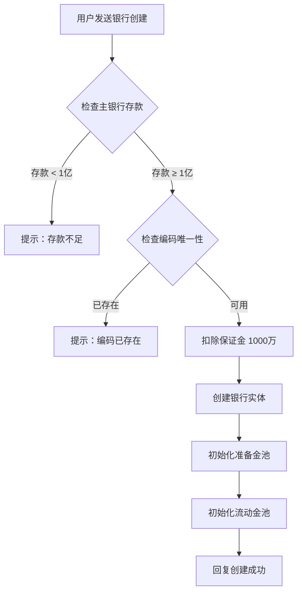

### 5.4 资金池设计

私人银行采用双池设计：

| 资金池 | 比例 | 说明 |
|--------|------|------|
| 准备金池（pb-reserve） | 80% | 存户资金的主要储备，不可用于放贷 |
| 流动金池（pb-liquidity） | 20% | 可用于放贷和运营 |
| 保证金（pb-guarantee） | 固定 1000 万 | 银行创建时缴纳的保证金 |

### 5.5 贷款系统

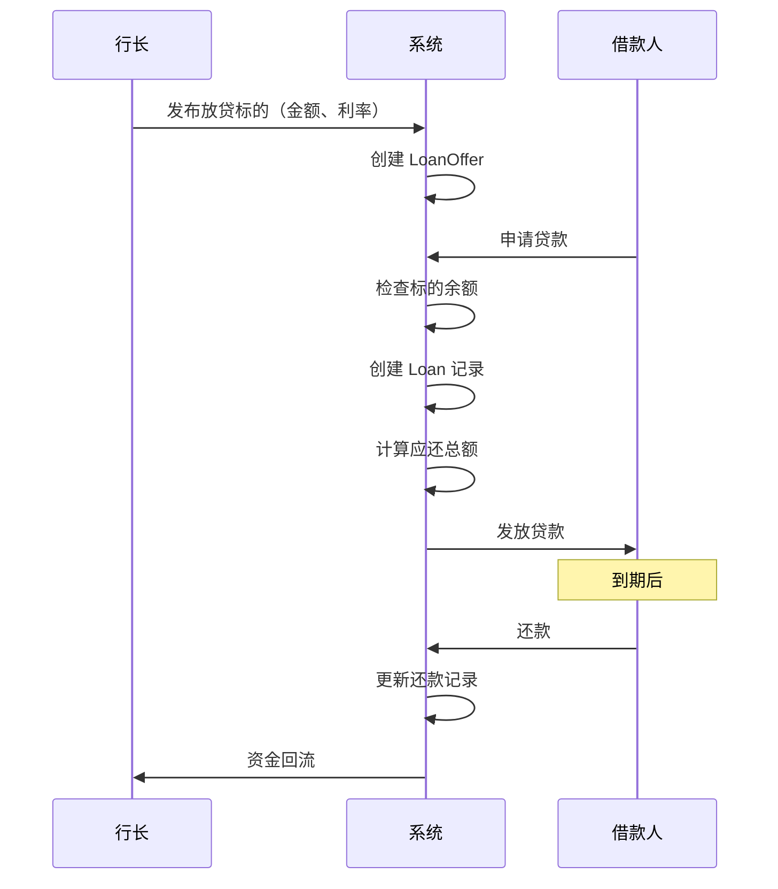

### 5.6 狐卷（债券）系统

狐卷是一种定期发行的债券，由行长竞标获取：

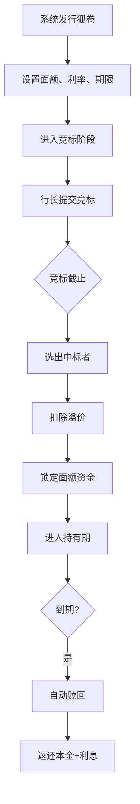

**狐卷生命周期**：

| 状态 | 说明 |
|------|------|
| BIDDING | 竞标中（每月 1 号和 15 号 08:00-18:00） |
| HOLDING | 持有中（中标后开始） |
| FINISHED | 已到期（赎回完成） |
| CANCELLED | 已取消 |

### 5.7 国卷系统

国卷是每周发行的固定收益债券：

| 属性 | 说明 |
|------|------|
| 发行频率 | 每周一轮 |
| 利率倍数 | 相对主银行利率的倍数（默认 2.0） |
| 锁仓天数 | 默认 3 天 |
| 额度限制 | 有总额度限制 |

### 5.8 评分系统

储户可以对私人银行进行 1-5 星评分：

- 每个用户每家银行只能评分一次
- 评分包含文字评价（可选）
- 平均评分影响银行的信用等级

### 5.9 失信机制

银行取款失败次数过多将进入失信状态：

- `withdrawFailures` 记录取款失败次数
- 失信状态下限制新存款
- 失信状态有时间期限（`defaulterUntil`）

### 5.10 关键类

| 类 | 职责 |
|----|------|
| `PrivateBankAction` | 私人银行指令入口 |
| `PrivateBankUsecase` | 私人银行业务逻辑 |
| `PrivateBankManager` | 私人银行管理 |
| `PrivateBankService` | 私人银行核心服务 |
| `PrivateBankFoxBondService` | 狐卷业务服务 |
| `PrivateBankLedger` | 账本/流水记录 |
| `PrivateBankRepository` | 私人银行数据仓库 |

---

## 六、钓鱼系统

### 6.1 设计概述

钓鱼系统是一个完整的休闲游戏模块，包含鱼塘管理、鱼竿升级、操作博弈、排行榜等功能。

### 6.2 系统架构

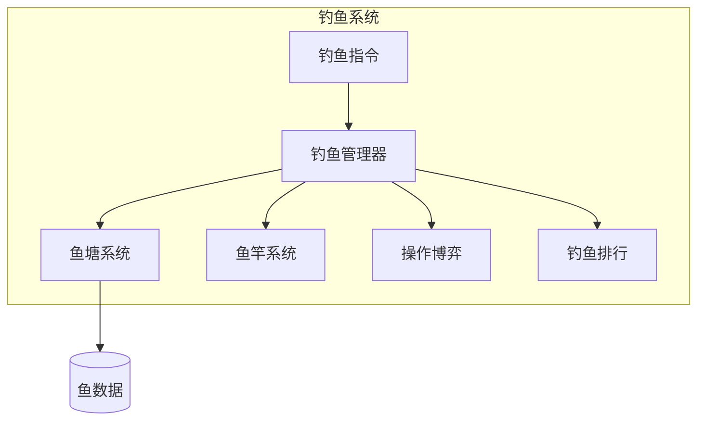

### 6.3 钓鱼流程

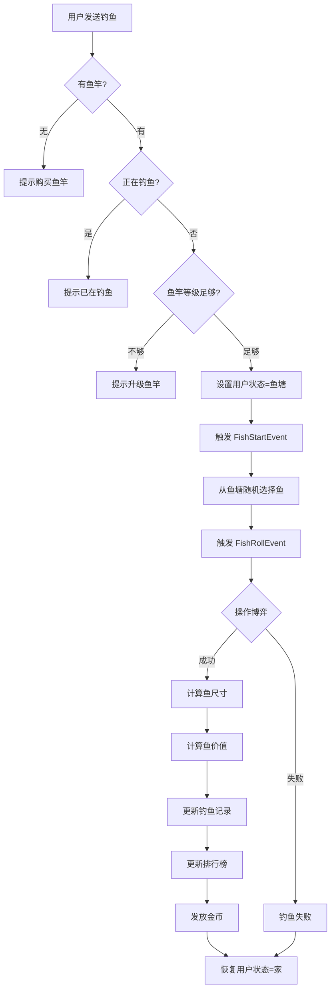

### 6.4 鱼竿系统

| 等级 | 升级费用 | 能力 |
|------|----------|------|
| 初始 | 500（购买） | 基础钓鱼 |
| 升级 | 递增费用 | 提升钓鱼成功率、进入更高等级鱼塘 |

### 6.5 鱼塘系统

鱼塘类型：

| 类型 | 编码格式 | 说明 |
|------|----------|------|
| 群鱼塘 | `g-{群号}` | 每个群的公共鱼塘 |
| 私人鱼塘 | `{群号}-{QQ}` | 用户私人鱼塘 |
| 全局鱼塘 | `{QQ}` | 跨群鱼塘 |

鱼塘等级影响可钓到的鱼的等级范围。

### 6.6 鱼的属性

| 属性 | 说明 |
|------|------|
| 等级（level） | 鱼的稀有度等级 |
| 名称（name） | 鱼的名称 |
| 单价（price） | 基础售价 |
| 尺寸范围 | dimensions1~dimensions4 分位数 |
| 难度（difficulty） | 钓到的难度 |
| 特殊标记（special） | 是否为彩蛋鱼 |

### 6.7 惊喜尺寸机制

钓到的鱼可能触发惊喜尺寸：

- **正常尺寸**：按 dimensions1~4 的概率分布随机
- **惊喜尺寸**：基础尺寸 × (1 + 进化因子)
- **胜利加成**：难度掷骰成功时，尺寸 +20%

### 6.8 关键类

| 类 | 职责 |
|----|------|
| `GamesAction` | 钓鱼指令入口 |
| `GamesUsecase` | 钓鱼业务逻辑 |
| `GamesManager` | 游戏管理器（生命周期） |
| `FishManager` | 钓鱼数据管理 |
| `FishStartEvent` | 钓鱼开始事件 |
| `FishRollEvent` | 钓鱼结果事件 |

---

## 七、抢劫系统

### 7.1 设计概述

抢劫系统允许用户之间进行金币争夺，包含丰富的概率计算和惩罚机制。

### 7.2 业务流程

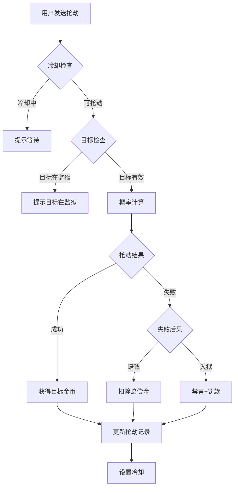

### 7.3 概率计算

抢劫成功率由多个因子共同决定：

| 因子 | 来源 | 影响 |
|------|------|------|
| 基础概率 | `GlobalFactor.robFactor`（默认 0.4） | 基础成功率 |
| 武力值 | `UserFactor.force`（默认 0.1） | 附加成功率 |
| 目标闪避 | `UserFactor.dodge`（默认 0.1） | 目标闪避概率 |
| 目标反抗 | `UserFactor.irritable`（默认 0.3） | 目标反抗概率 |

**最终概率** = 基础概率 + 武力值 - 目标闪避

### 7.4 失败后果

| 后果 | 概率 | 说明 |
|------|------|------|
| 赔钱 | 较高 | 赔偿目标一定金额 |
| 入狱 | 较低 | 被禁言 + 罚款 |

### 7.5 抢银行

| 属性 | 说明 |
|------|------|
| 基础概率 | 1%（`GlobalFactor.robBlankFactor`） |
| 奖励 | 银行总金的一定比例 |
| 失败惩罚 | 与普通抢劫相同 |

### 7.6 监狱系统

| 属性 | 说明 |
|------|------|
| 禁言时长 | 配置 `jailCoolTime`（默认 3600 秒） |
| 出狱方式 | 自动到期 / 保释 |
| 保释 | 其他用户可保释在押用户 |

### 7.7 关键类

| 类 | 职责 |
|----|------|
| `RobAction` | 抢劫指令入口 |
| `RobUsecase` | 抢劫业务逻辑 |
| `RobManager` | 抢劫管理 |

---

## 八、红包系统

### 8.1 设计概述

红包系统支持在群内发放和领取红包，有三种红包类型。

### 8.2 业务流程

#### 发红包流程

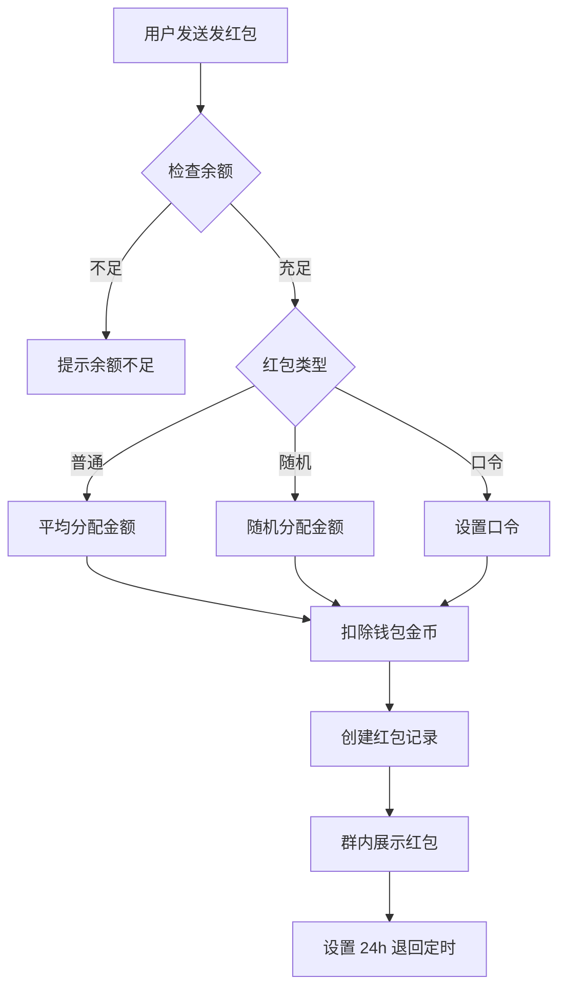

#### 领红包流程

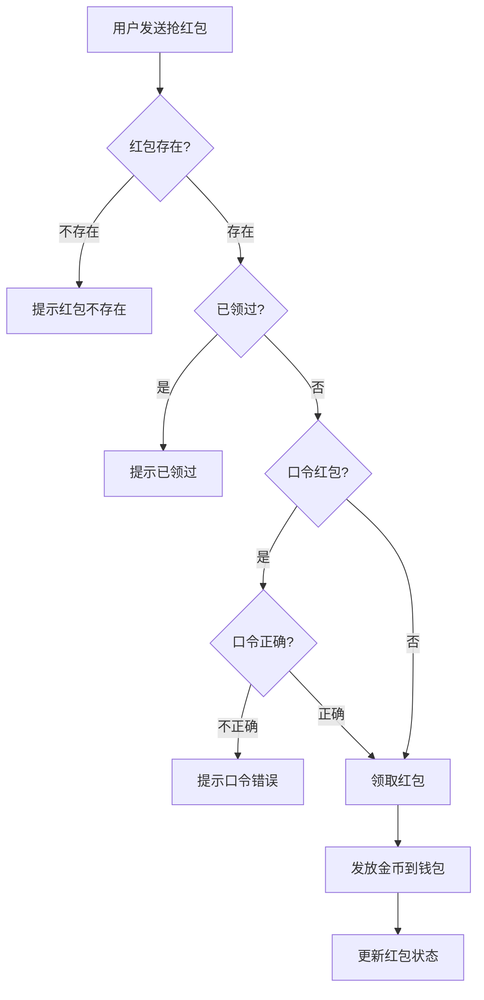

### 8.3 红包类型

| 类型 | 分配方式 | 特点 |
|------|----------|------|
| 普通红包 | 平均分配 | 每人获得相同金额 |
| 随机红包 | 随机分配 | 每人获得不同金额，总和等于总额 |
| 口令红包 | 平均/随机 | 需输入正确口令才能领取 |

### 8.4 红包退回

- **退回条件**：24 小时未领完
- **退回金额**：总金额 - 已领走金额
- **退回方式**：自动退回到发送者钱包

### 8.5 关键类

| 类 | 职责 |
|----|------|
| `RedPackAction` | 红包指令入口 |
| `RedPackUsecase` | 红包业务逻辑 |
| `RedPackManager` | 红包管理 |
| `RedPackRepository` | 红包数据仓库 |

---

## 九、抽奖系统

### 9.1 设计概述

抽奖系统包含两种玩法：彩票猜签和抽奖（单抽/十连）。

### 9.2 彩票猜签

#### 彩票类型

| 类型 | 开奖频率 | 说明 |
|------|----------|------|
| 小签 | 每分钟 | 分钟彩票 |
| 中签 | 每小时 | 小时彩票 |
| 大签 | 每天 | 天彩票 |

#### 猜签流程

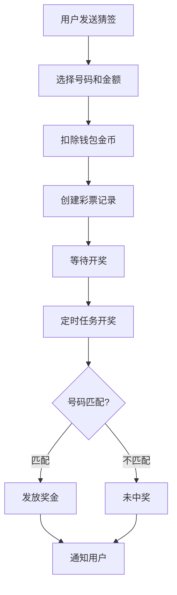

### 9.3 抽奖系统

#### 抽奖流程

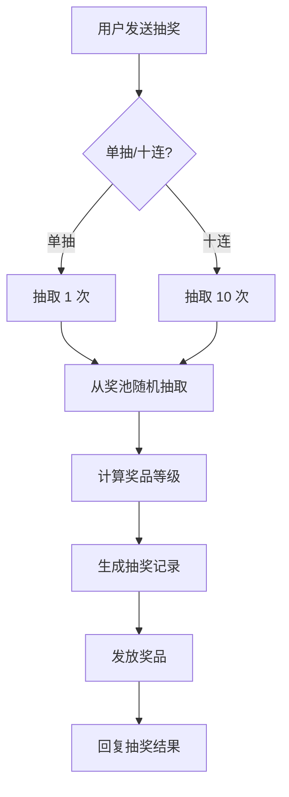

#### 奖品类型

| 类型 | 说明 |
|------|------|
| ORDINARY | 普通奖品 |
| PROP | 道具奖品 |
| TITLE | 称号奖品 |
| MONEY | 金币奖品 |
| PUNISHMENT | 惩罚（负面效果） |

#### 抽奖记录

- `RaffleBatch`：抽奖批次（一次抽奖/十连为一个批次）
- `RaffleRecord`：抽奖明细（每个奖品为一条记录）

### 9.4 关键类

| 类 | 职责 |
|----|------|
| `LotteryAction` | 彩票指令入口 |
| `LotteryUsecase` | 彩票业务逻辑 |
| `LotteryManager` | 彩票管理 |
| `LotteryTaskManager` | 彩票开奖定时任务 |
| `LuckyDrawAction` | 抽奖指令入口 |
| `LuckyDrawUsecase` | 抽奖业务逻辑 |
| `LuckyDrawManager` | 抽奖管理 |

---

## 十、道具系统

### 10.1 设计概述

道具系统提供各种功能性道具，可通过商店购买、签到掉落等方式获得。

### 10.2 道具分类

| 分类编码 | 说明 | 示例 |
|----------|------|------|
| `CARD` | 卡片类 | 禁言卡 |
| `F_PROP` | 功能道具 | 各种增益道具 |
| `FISH_BAIT` | 鱼饵 | 钓鱼专用饵料 |

### 10.3 道具数据模型

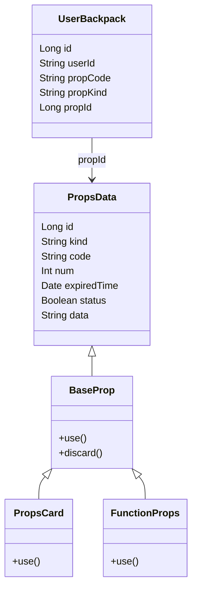

### 10.4 道具使用流程

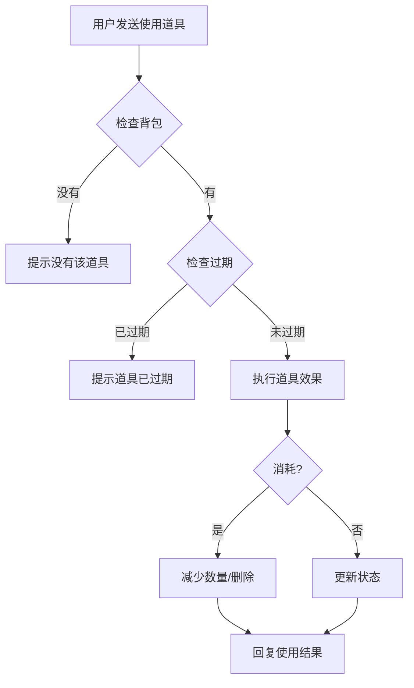

### 10.5 特殊道具说明

#### 禁言卡

| 属性 | 说明 |
|------|------|
| 功能 | 对目标用户实施禁言 |
| 限制 | 部分群禁止使用（配置 `unableToUseMuteGroup`） |
| 消耗 | 使用后消耗 |

#### 鱼饵

| 属性 | 说明 |
|------|------|
| 功能 | 提升钓鱼成功率或鱼的品质 |
| 分类 | `FISH_BAIT` |
| 使用方式 | 钓鱼时自动消耗 |

### 10.6 关键类

| 类 | 职责 |
|----|------|
| `BackpackAction` | 背包指令入口 |
| `BackpackUsecase` | 背包业务逻辑 |
| `BackpackManager` | 背包管理 |
| `PropsManager` | 道具管理 |
| `PropsShop` | 道具商店 |
| `PropSystem` | 道具系统入口 |

---

## 十一、称号系统

### 11.1 设计概述

称号系统提供个性化称号展示，支持自定义颜色、渐变效果和特殊 Buff。

### 11.2 称号类型

| 获取方式 | 示例 | 有效期 |
|----------|------|--------|
| 成就解锁 | 连续签到 15 天/90 天 | 有限期 / 永久 |
| 商店购买 | 尊贵称号 | 30 天 |
| 自动触发 | 富豪、钓鱼达人、赌怪 | 永久 |

### 11.3 称号显示效果

```mermaid
graph LR
    subgraph 签到图片
        A[头像] --> B[QQ号]
        B --> C[称号名称]
        C --> D[用户昵称]
    end
```

- **普通称号**：单色显示
- **渐变称号**：起始颜色到结束颜色的渐变效果
- **影响昵称**：部分称号替换签到图片中的用户昵称

### 11.4 称号购买流程

```mermaid
flowchart TD
    A[用户发送购买称号] --> B{检查称号商店}
    B -->|不存在| C[提示称号不存在]
    B -->|存在| D{检查余额}
    D -->|不足| E[提示余额不足]
    D -->|充足| F[扣除金币]
    F --> G[创建 TitleInfo 记录]
    G --> H[设置过期时间]
    H --> I[回复购买成功]
```

### 11.5 称号切换

- 用户可拥有多个称号
- 同一时间只能激活一个称号
- 切换称号序号 `0` 表示卸下当前称号

### 11.6 称号模板系统

称号模板（`TitleTemplate`）定义称号的显示规则：

| 实现类 | 说明 |
|--------|------|
| `TitleTemplateSimpleImpl` | 简单称号模板 |
| `CustomTitle` | 自定义称号模板 |

模板在 `TitleTemplateManager.loadingCustomTitle()` 中注册。

### 11.7 关键类

| 类 | 职责 |
|----|------|
| `TitleAction` | 称号指令入口 |
| `TitleUsecase` | 称号业务逻辑 |
| `TitleManager` | 称号管理 |
| `TitleTemplateManager` | 称号模板管理 |

---

## 十二、转账系统

### 12.1 设计概述

转账系统允许用户之间直接转移金币。

### 12.2 转账流程

```mermaid
flowchart TD
    A[用户发送转账] --> B{检查目标用户}
    B -->|不存在| C[提示用户不存在]
    B -->|存在| D{检查自身余额}
    D -->|不足| E[提示余额不足]
    D -->|充足| F[扣除发送者金币]
    F --> G[增加接收者金币]
    G --> H[回复转账成功]
```

### 12.3 转账规则

| 规则 | 说明 |
|------|------|
| 最低金额 | 正整数 |
| 不能自转 | 不能给自己转账 |
| 余额检查 | 发送者钱包余额必须充足 |
| 即时到账 | 转账即时生效 |

### 12.4 关键类

| 类 | 职责 |
|----|------|
| `TransferAction` | 转账指令入口 |
| `TransferUsecase` | 转账业务逻辑 |
| `TransferManager` | 转账管理 |

---

## 十三、定时任务系统

### 13.1 设计概述

定时任务系统（`HuYanScheduler`）提供统一的任务调度能力，支持延时任务和周期任务。

### 13.2 调度器架构

```mermaid
graph TD
    Scheduler[HuYanScheduler 调度器] --> Engine[SchedulerEngine 引擎接口]
    Engine --> Executor[ScheduledExecutorEngine]
    Executor --> Tasks[定时任务]

    Tasks --> BankTask[银行利息结算]
    Tasks --> LotteryTask[彩票开奖]
    Tasks --> RedPackTask[红包退回]
    Tasks --> FoxBondTask[狐卷竞标]
    Tasks --> GovBondTask[国卷发行]
```

### 13.3 主要定时任务

| 任务 | 触发频率 | 说明 |
|------|----------|------|
| 银行利息结算 | 每周 | 计算并发放存款利息 |
| 彩票开奖 | 每分钟/小时/天 | 根据彩票类型开奖 |
| 红包退回 | 24 小时后 | 退回未领完的红包 |
| 狐卷竞标 | 每月 1/15 号 | 开启狐卷竞标 |
| 国卷发行 | 每周 | 发行新一期国卷 |
| 签到状态重置 | 每日 | 重置签到状态 |

### 13.4 关键类

| 类 | 职责 |
|----|------|
| `HuYanScheduler` | 调度器入口（单例） |
| `SchedulerEngine` | 调度引擎接口 |
| `ScheduledExecutorEngine` | 基于 ScheduledExecutorService 的实现 |
| `ScheduledTask` | 任务定义接口 |

---

## 相关文档

- [项目结构说明](项目结构说明.md)
- [项目开发说明](项目开发说明.md)
- [配置说明](配置说明.md)
- [指令参考手册](指令参考手册.md)
- [数据库设计](数据库设计.md)
- [FAQ](FAQ.md)
