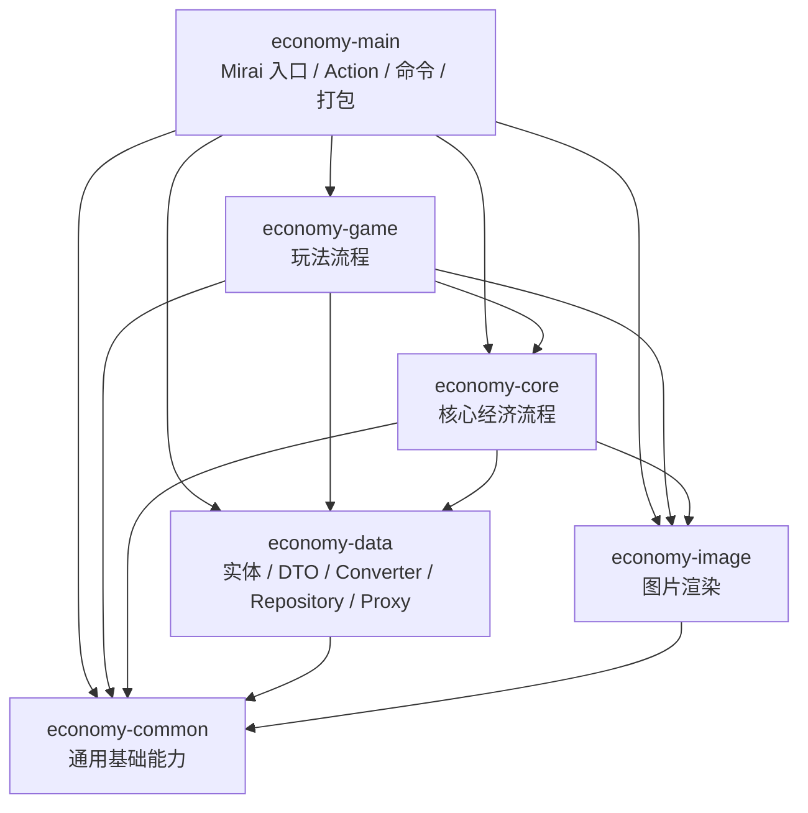
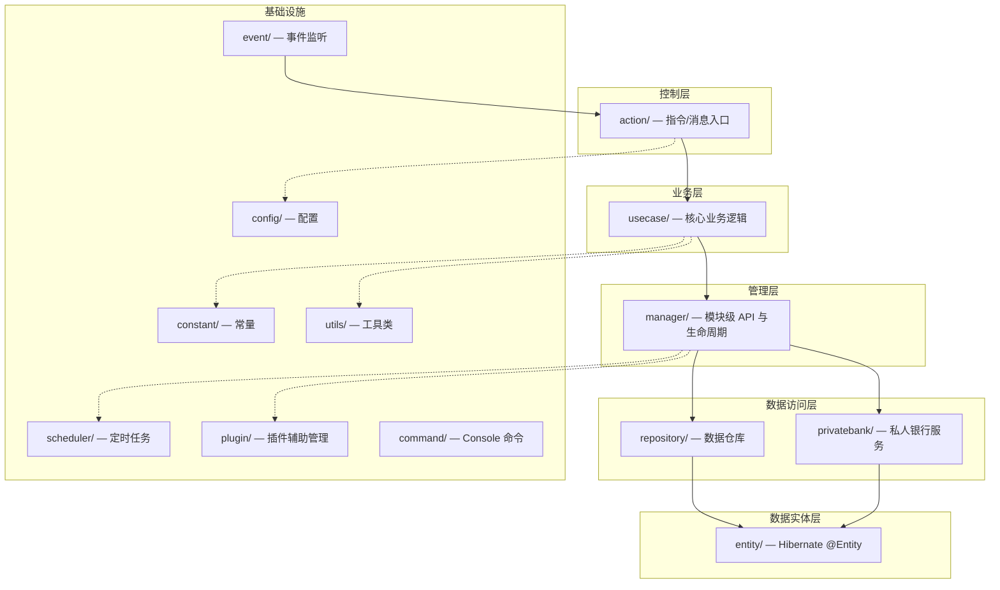
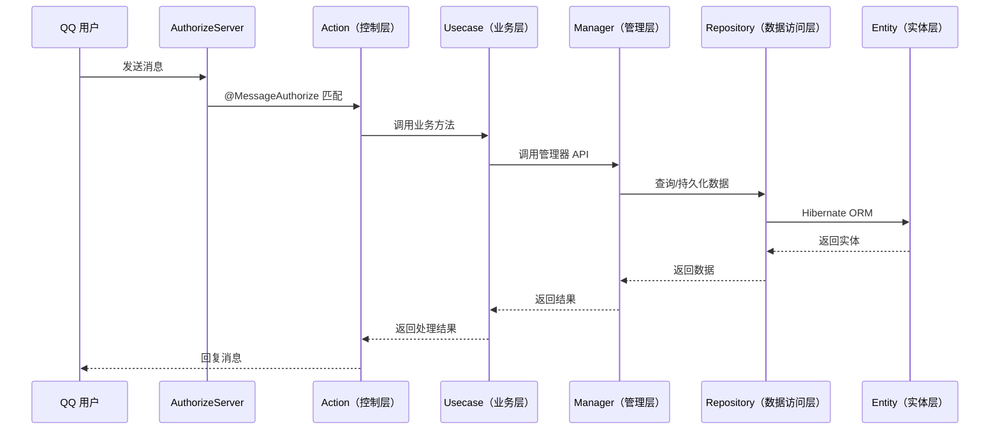
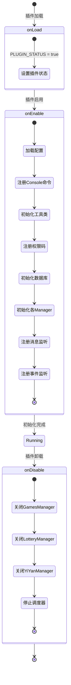

# 壶言经济（HuYanEconomy）项目结构说明

## 一、项目概述

壶言经济（HuYanEconomy）是一款基于 [Mirai Console](https://github.com/mamoe/mirai) 的 QQ 机器人经济插件，使用 Kotlin 编写。提供签到、银行、钓鱼、抢劫、抽奖、道具、私人银行等娱乐经济功能。

### 技术栈

| 项目 | 技术选型 |
|------|----------|
| 语言 | Kotlin 1.9.20, JVM Target 11 |
| 框架 | mirai-console 2.16.0 |
| 构建 | Gradle KTS |
| ORM | Hibernate（通过 mirai-hibernate-plugin 运行时提供） |
| 权限系统 | [HuYanAuthorize](https://github.com/Moyuyanli/HuYanAuthorize)（KSP 注解处理） |
| 序列化 | kotlinx-serialization |
| 图片生成 | Apache POI + Java AWT |

---

## 二、完整目录结构树

```
HuYanEconomy/
├── build.gradle.kts                  # Gradle 构建脚本
├── settings.gradle.kts               # Gradle 设置
├── gradle.properties                 # Gradle 属性配置
├── gradlew / gradlew.bat             # Gradle Wrapper
├── AGENTS.md                         # AI 代理指南
├── README.md                         # 项目说明
├── LICENSE                           # 开源许可证
│
├── build/                            # 构建输出目录
│   ├── mirai/                        # 构建产物（插件 jar）
│   ├── generated/ksp/                # KSP 生成代码（勿手动修改）
│   └── ...
│
├── buildSrc/                         # Gradle 构建源码（版本常量等）
│
├── docs/                             # 项目文档
│   └── 项目结构说明.md               # 本文档
│
├── plan/                             # 版本规划文档
│   ├── v2.0.0/                       # v2.0.0 规划
│   │   ├── 2.0.0.md
│   │   ├── 2.0.0实际执行.md
│   │   ├── 私人银行系统.md
│   │   ├── 私人银行系统补充规范：多维动态竞标机制 (v1.2).md
│   │   ├── 私人银行与国卷系统：核心补充规范 (v1.1).md
│   │   └── manager-api.md
│   └── v2.0.1/                       # v2.0.1 规划
│       └── 2.0.1.md
│
├── resources/                        # 外部资源（设计稿等）
├── src/main/resources/               # 历史资源残留；新增插件资源优先放入 economy-main
│
├── debug-sandbox/                    # 本地调试环境
│   ├── bots/                         # Bot 配置（QQ 号目录）
│   ├── config/                       # 插件运行时配置
│   ├── data/                         # 插件运行时数据
│   ├── plugins/                      # 依赖插件 jar
│   ├── plugin-libraries/             # 插件依赖库
│   ├── plugin-shared-libraries/      # 共享依赖库
│   └── logs/                         # 运行日志
│
├── economy-common/                  # 通用基础模块
│   ├── build.gradle.kts             # common 模块构建脚本
│   └── src/
│       ├── main/kotlin/cn/chahuyun/economy/
│       │   ├── common/              # 通用 Result、文本模板、概率等基础能力
│       │   ├── constant/            # 平台弱相关常量
│       │   └── utils/               # 时间、金额、格式化、日志等兼容工具
│       └── test/kotlin/             # common 边界测试
│
├── economy-data/                    # 数据模块
│   ├── build.gradle.kts
│   └── src/
│       ├── main/kotlin/cn/chahuyun/economy/
│       │   ├── converter/           # V1/V2 Converter
│       │   ├── data/cache/          # 缓存与一致性基础设施
│       │   ├── data/proxy/          # EntityProxy、数据版本、迁移入口
│       │   ├── data/repository/     # Hibernate 数据仓储
│       │   ├── entity/              # V1 Hibernate 实体
│       │   ├── entity/v2/           # V2 Hibernate 实体
│       │   └── model/               # DTO / 数据模型
│       └── test/kotlin/             # data 边界测试
│
├── economy-image/                   # 图片渲染模块
│   ├── build.gradle.kts
│   └── src/
│       ├── main/kotlin/cn/chahuyun/economy/
│       │   └── image/               # 渲染器、卡片、画布和图片工具
│       └── test/kotlin/             # image smoke test 与边界测试
│
├── economy-core/                    # 核心经济流程模块
│   ├── build.gradle.kts
│   └── src/
│       ├── main/kotlin/cn/chahuyun/economy/
│       │   ├── config/              # Mirai 配置对象，当前阶段暂保留在 core
│       │   ├── manager/             # 签到、银行、背包、称号、红包等管理器
│       │   ├── privatebank/         # 私人银行业务服务
│       │   ├── prop/                # 道具系统
│       │   ├── repair/              # 数据修复逻辑
│       │   ├── runtime/             # core 访问插件运行时的短期门面
│       │   ├── scheduler/           # 调度器
│       │   ├── service/             # 行为型 DTO/service 承接层
│       │   └── usecase/             # 核心 usecase
│       └── test/kotlin/             # core 边界测试
│
├── economy-game/                    # 玩法模块
│   ├── build.gradle.kts
│   └── src/
│       ├── main/kotlin/cn/chahuyun/economy/
│       │   ├── constant/            # 玩法常量
│       │   ├── entity/              # 暂留玩法实体，后续继续向 data 收敛
│       │   ├── fish/                # 钓鱼事件
│       │   ├── game/                # 玩法概览 Provider 等桥接实现
│       │   ├── manager/             # 钓鱼、抢劫、抽奖、农场等玩法管理器
│       │   ├── model/               # 玩法运行时扩展行为与 ViewState
│       │   ├── plugin/              # 玩法资源管理
│       │   ├── repository/          # 暂留玩法仓储，后续继续向 data 收敛
│       │   ├── service/             # 玩法服务
│       │   └── usecase/             # 玩法 usecase
│       └── test/kotlin/             # game 边界测试
│
└── economy-main/                    # Mirai 插件入口与最终打包模块
    ├── build.gradle.kts             # Mirai 插件打包脚本，包含 KSP
    └── src/
        ├── main/kotlin/cn/chahuyun/economy/
        │   ├── HuYanEconomy.kt      # 插件主类
        │   ├── action/              # 指令/消息入口
        │   ├── command/             # Console 命令
        │   ├── event/               # Mirai 事件监听
        │   ├── plugin/              # 插件注册与权限注册
        │   ├── service/             # main 侧启动服务与适配
        │   └── version/             # 启动版本检查
        ├── main/resources/          # 插件资源、ServiceLoader、图片与数据表
        └── test/kotlin/             # main 入口边界测试
```

---

## 三、架构分层

### 模块依赖总览

2.0.0 采用 Gradle 多模块结构，主产物仍由 `economy-main` 打包为 Mirai 插件 jar。



约束：

- `economy-common` 不依赖 Mirai、Hibernate 或其他项目内模块。
- `economy-data` 不反向依赖 `core/game/main/image`。
- `economy-image` 不负责 Mirai 图片上传或消息发送，只输出图片对象或字节。
- `economy-core` 当前仍依赖 `economy-image`，这是 2.0.0 迁移期保留的实际依赖。
- `economy-core` / `economy-game` 当前阶段允许保留 Mirai 类型和发送逻辑，后续再逐步收敛。

### 逻辑分层总览

下面的分层描述仍按业务调用链理解；实际物理文件已经分布到各 Gradle 模块中。



### 调用流程示例



---

## 四、各模块职责详解

本章按逻辑职责说明各类代码的作用。2.0.0 后这些逻辑目录已经分布到不同 Gradle 模块中：

- `action/command/event/plugin/version` 主要位于 `economy-main`。
- 核心经济 `manager/usecase/privatebank/prop/repair/scheduler/service` 主要位于 `economy-core`。
- 玩法 `manager/usecase/fish/plugin/repository` 主要位于 `economy-game`。
- `entity/model/converter/data/repository/data/proxy` 主要位于 `economy-data`。
- 图片渲染位于 `economy-image`。
- 通用常量和基础工具位于 `economy-common`。

### 4.1 控制层 — `action/`

指令/消息入口层，通过 `@MessageAuthorize` 注解声明消息匹配规则，由 `AuthorizeServer.registerEvents()` 自动扫描注册。

| 文件 | 职责 |
|------|------|
| `BankAction.kt` | 银行操作指令（存款、取款、查询余额） |
| `SignAction.kt` | 签到指令 |
| `GamesAction.kt` | 游戏指令（钓鱼等） |
| `LotteryAction.kt` | 彩票指令 |
| `LuckyDrawAction.kt` | 抽奖指令 |
| `RobAction.kt` | 抢劫指令 |
| `RedPackAction.kt` | 红包指令 |
| `BackpackAction.kt` | 背包指令 |
| `TransferAction.kt` | 转账指令 |
| `TitleAction.kt` | 称号指令 |
| `PrivateBankAction.kt` | 私人银行指令 |
| `FundingAction.kt` | 基金指令 |
| `FoxBondAction.kt` | 狐券指令 |
| `EventPropsAction.kt` | 活动道具指令 |
| `UserAction.kt` | 用户信息指令 |
| `UserStatusAction.kt` | 用户状态指令 |
| `HelpAction.kt` | 帮助指令 |

### 4.2 业务层 — `usecase/`

核心业务逻辑层，实现具体的业务规则和流程编排。每个 Usecase 对应一个功能模块。

| 文件 | 职责 |
|------|------|
| `BankUsecase.kt` | 银行业务逻辑 |
| `SignUsecase.kt` | 签到业务逻辑 |
| `GamesUsecase.kt` | 游戏业务逻辑 |
| `LotteryUsecase.kt` | 彩票业务逻辑 |
| `LuckyDrawUsecase.kt` | 抽奖业务逻辑 |
| `RobUsecase.kt` | 抢劫业务逻辑 |
| `RedPackUsecase.kt` | 红包业务逻辑 |
| `BackpackUsecase.kt` | 背包业务逻辑 |
| `TransferUsecase.kt` | 转账业务逻辑 |
| `TitleUsecase.kt` | 称号业务逻辑 |
| `PrivateBankUsecase.kt` | 私人银行业务逻辑 |
| `FundingUsecase.kt` | 基金业务逻辑 |
| `FoxBondUsecase.kt` | 狐券业务逻辑 |
| `EventPropsUsecase.kt` | 活动道具业务逻辑 |
| `UserUsecase.kt` | 用户信息业务逻辑 |
| `UserStatusUsecase.kt` | 用户状态业务逻辑 |

### 4.3 管理层 — `manager/`

模块级 API 与生命周期管理。提供对外的模块接口，负责初始化和关闭资源。

| 文件 | 职责 |
|------|------|
| `BankManager.kt` | 银行模块管理（初始化、余额操作 API） |
| `SignManager.kt` | 签到管理（随机金币、道具发放） |
| `GamesManager.kt` | 游戏管理（游戏生命周期） |
| `LotteryManager.kt` | 彩票管理 |
| `LotteryTaskManager.kt` | 彩票定时任务管理 |
| `LuckyDrawManager.kt` | 抽奖管理 |
| `RobManager.kt` | 抢劫管理 |
| `RedPackManager.kt` | 红包管理 |
| `BackpackManager.kt` | 背包管理 |
| `TransferManager.kt` | 转账管理 |
| `TitleManager.kt` | 称号管理 |
| `PrivateBankManager.kt` | 私人银行管理 |
| `BankTaskManager.kt` | 银行定时任务管理 |
| `EventPropsManager.kt` | 活动道具管理 |
| `MissionManager.kt` | 任务系统管理 |
| `UserCoreManager.kt` | 用户核心数据管理 |
| UserStatusManager.kt | 用户状态管理 |
| FundingManager.kt | 基金管理（无独立 Manager，逻辑在 FundingUsecase 中） |

### 4.4 数据访问层 — `repository/`

数据持久化访问，通过 Hibernate 与数据库交互。

| 文件 | 职责 |
|------|------|
| `FishRepository.kt` | 钓鱼数据仓库 |
| `RedPackRepository.kt` | 红包数据仓库 |
| `UserRaffleRepository.kt` | 用户抽奖数据仓库 |

> **私人银行仓库**位于 `privatebank/PrivateBankRepository.kt`。

### 4.5 数据实体层 — `entity/`

Hibernate `@Entity` 实体定义，按业务域划分子包。

#### 根级实体

| 文件 | 职责 |
|------|------|
| `UserInfo.kt` | 用户基础信息 |
| `UserProperty.kt` | 用户资产 |
| `UserBackpack.kt` | 用户背包 |
| `UserStatus.kt` | 用户状态 |
| `UserFactor.kt` | 用户因子 |
| `UserRaffle.kt` | 用户抽奖记录 |
| `GlobalFactor.kt` | 全局因子 |
| `LotteryInfo.kt` | 彩票信息 |
| `TitleInfo.kt` | 称号信息 |

#### `entity/bank/` — 银行实体

| 文件 | 职责 |
|------|------|
| `BankInfo.kt` | 银行账户信息 |

#### `entity/fish/` — 钓鱼实体

| 文件 | 职责 |
|------|------|
| `Fish.kt` | 鱼类实体 |
| `FishInfo.kt` | 钓鱼信息 |
| `FishPond.kt` | 鱼塘 |
| `FishRanking.kt` | 钓鱼排行 |

#### `entity/privatebank/` — 私人银行实体

| 文件 | 职责 |
|------|------|
| `PrivateBank.kt` | 私人银行 |
| `PrivateBankDeposit.kt` | 存款记录 |
| `PrivateBankLoan.kt` | 贷款记录 |
| `PrivateBankLoanOffer.kt` | 贷款报价 |
| `PrivateBankReview.kt` | 审核记录 |
| `PrivateBankFoxBond.kt` | 狐券 |
| `PrivateBankFoxBondBid.kt` | 狐券竞标 |
| `PrivateBankFoxBondHolding.kt` | 狐券持有 |
| `PrivateBankGovBondHolding.kt` | 国券持有 |
| `PrivateBankGovBondIssue.kt` | 国券发行 |

#### `entity/props/` — 道具实体

| 文件 | 职责 |
|------|------|
| `PropsData.kt` | 道具数据 |

#### `entity/raffle/` — 抽奖实体

| 文件 | 职责 |
|------|------|
| `RaffleBatch.kt` | 抽奖批次 |
| `RaffleRecord.kt` | 抽奖记录 |

#### `entity/redpack/` — 红包实体

| 文件 | 职责 |
|------|------|
| `RedPack.kt` | 红包 |

#### `entity/rob/` — 抢劫实体

| 文件 | 职责 |
|------|------|
| `RobInfo.kt` | 抢劫信息 |

### 4.6 配置 — `config/`

基于 mirai-console `AutoSavePluginConfig` 的配置类，支持热重载。

| 文件 | 职责 |
|------|------|
| `EconomyConfig.kt` | 主配置（Bot QQ 号、前缀、数据库等） |
| `EconomyPluginConfig.kt` | 插件运行配置（首次启动标记等） |
| `FishingMsgConfig.kt` | 钓鱼消息文案配置 |
| `RobMsgConfig.kt` | 抢劫消息文案配置 |

### 4.7 常量 — `constant/`

全局常量定义。

| 文件 | 职责 |
|------|------|
| `Constant.kt` | 通用常量 |
| `EconPerm.kt` | 权限码常量 |
| `Icon.kt` | 图标资源 |
| `ImageDrawXY.kt` | 图片绘制坐标 |
| `FishPondLevelConstant.kt` | 鱼塘等级常量 |
| `PrizeType.kt` | 奖品类型 |
| `PropConstant.kt` | 道具常量 |
| `PropsKind.kt` | 道具分类 |
| `RaffleType.kt` | 抽奖类型 |
| `TitleCode.kt` | 称号编码 |
| `UserLocation.kt` | 用户位置 |

### 4.8 定时任务 — `scheduler/`

定时任务调度引擎，支持延时任务和周期任务。

| 文件 | 职责 |
|------|------|
| `HuYanScheduler.kt` | 调度器入口（单例） |
| `SchedulerEngine.kt` | 调度引擎接口 |
| `ScheduledExecutorEngine.kt` | 基于 `ScheduledExecutorService` 的引擎实现 |
| `ScheduledTask.kt` | 任务定义 |

### 4.9 插件辅助管理 — `plugin/`

插件运行时的辅助管理器，负责资源初始化和全局状态维护。

| 文件 | 职责 |
|------|------|
| `PluginManager.kt` | 插件综合管理（初始化入口） |
| `PermCodeManager.kt` | 权限码注册管理 |
| `ImageManager.kt` | 图片资源管理 |
| `FishManager.kt` | 钓鱼数据管理 |
| `FactorManager.kt` | 因子系统管理 |
| `PluginPropsManager.kt` | 道具插件管理 |
| `TitleTemplateManager.kt` | 称号模板管理 |
| `YiYanManager.kt` | 一言（随机语句）管理 |

### 4.10 私人银行服务层 — `privatebank/`

私人银行模块的独立服务层，包含业务逻辑和数据访问。

| 文件 | 职责 |
|------|------|
| `PrivateBankService.kt` | 私人银行核心服务 |
| `PrivateBankFoxBondService.kt` | 狐券业务服务 |
| `PrivateBankLedger.kt` | 账本/流水记录 |
| `PrivateBankRepository.kt` | 私人银行数据仓库 |

### 4.11 数据模型 — `model/`

数据传输对象（DTO）、值对象（VO）和领域模型。

| 子包 | 文件 | 职责 |
|------|------|------|
| `bank/` | `AbstractBank.kt`, `Bank.kt`, `action/` | 银行模型与动作定义 |
| `currency/` | `GoldEconomyCurrency.kt` | 货币模型 |
| `fish/` | `FishBait.kt` | 鱼饵模型 |
| `props/` | `Equipment.kt`, `FunctionProps.kt`, `PropsCard.kt`, `UseEvent.kt` | 道具模型 |
| `title/` | `CustomTitle.kt`, `TitleApi.kt`, `TitleTemplate.kt`, `TitleTemplateSimpleImpl.kt` | 称号模型 |
| `yiyan/` | `YiYan.kt` | 一言模型 |

### 4.12 其他子系统

#### 钓鱼子系统 — `fish/`

| 文件 | 职责 |
|------|------|
| `FishStartEvent.kt` | 钓鱼开始事件 |
| `FishRollEvent.kt` | 钓鱼结果掷骰事件 |

#### 签到子系统 — `sign/`

| 文件 | 职责 |
|------|------|
| `SignEvent.kt` | 签到事件 |

#### 奖品处理 — `prizes/`

| 文件 | 职责 |
|------|------|
| `Prizes.kt` | 奖品定义 |
| `PrizeHandle.kt` | 奖品处理逻辑 |

#### 道具系统 — `prop/`

| 文件 | 职责 |
|------|------|
| `PropsManager.kt` | 道具管理 |
| `PropsShop.kt` | 道具商店 |
| `PropSystem.kt` | 道具系统入口 |
| `effect/` | 道具效果处理器与注册表 |

#### 事件监听 — `event/`

| 文件 | 职责 |
|------|------|
| `BotOnlineEventListener.kt` | Bot 上线事件监听 |

#### Console 命令 — `command/`

| 文件 | 职责 |
|------|------|
| `EconomyCommand.kt` | Console 终端命令（如 `hye repair`） |

#### 工具类 — `utils/`

| 文件 | 职责 |
|------|------|
| `EconomyUtil.kt` | 经济核心工具（余额操作等） |
| `HibernateUtil.kt` | Hibernate Session 管理 |
| `ImageUtil.kt` | 图片生成工具 |
| `MessageUtil.kt` | 消息构建工具 |
| `Log.kt` | 日志工具（封装 mirai logger） |
| `FormatUtil.kt` | 格式化工具 |
| `MoneyFormatUtil.kt` | 金额格式化工具 |
| `DateUtil.kt` | 日期工具 |
| `TimeConvertUtil.kt` | 时间转换工具 |
| `ShareUtils.kt` | 通用工具 |

#### 数据存储 — `data/`

| 文件 | 职责 |
|------|------|
| `PrizesData.kt` | 奖品数据存储（AutoSavePluginData） |

#### 数据修复 — `repair/`

| 文件 | 职责 |
|------|------|
| `Repair.kt` | 数据库修复工具（版本迁移用） |

#### 版本检查 — `version/`

| 文件 | 职责 |
|------|------|
| `CheckLatestVersion.kt` | 检查最新版本 |

#### 自定义异常 — `exception/`

| 文件 | 职责 |
|------|------|
| `Operation.kt` | 操作异常 |
| `RaffleException.kt` | 抽奖异常 |

---

## 五、关键文件说明

### 5.1 入口类 `HuYanEconomy.kt`

插件主类，Kotlin `object` 单例，继承 `KotlinPlugin`。定义插件元信息（ID、版本、依赖），并编排整个插件的初始化流程。

**插件元信息：**
- **ID**: `cn.chahuyun.HuYanEconomy`
- **版本**: 由 `EconomyBuildConstants.VERSION`（`economy-common` 的 BuildConfig 生成）提供
- **依赖**: `mirai-economy-core >= 1.0.6`、`HuYanAuthorize >= 1.3.6`

### 5.2 构建脚本

项目使用 Gradle 多模块构建：

- 根 `settings.gradle.kts` 只声明六个正式模块。
- 根 `build.gradle.kts` 统一设置 group/version、JVM Target、log4j 排除，并提供根 `buildPlugin` 同步任务。
- `economy-main/build.gradle.kts` 应用 mirai-console 与 KSP 插件，负责 `AuthorizeRegistrar` 生成和最终 Mirai 插件打包。
- `economy-common/build.gradle.kts` 负责生成 `EconomyBuildConstants`。
- `economy-data/image/core/game/build.gradle.kts` 只声明各自模块依赖和测试依赖。

### 5.3 调试环境 `debug-sandbox/`

本地开发调试用目录，模拟 mirai-console 运行环境：
- `bots/` — Bot QQ 号配置
- `config/` — 各插件运行时配置
- `data/` — 插件运行时数据
- `plugins/` — 依赖插件 jar

### 5.4 KSP 生成代码 `economy-main/build/generated/ksp/`

由 HuYanAuthorize 的 KSP 处理器在 `economy-main` 中自动生成的 `AuthorizeRegistrar`，负责注册 `@MessageAuthorize` 注解的事件处理器。**严禁手动修改。**

---

## 六、插件生命周期



### 6.1 `onLoad` 阶段

- 设置 `PLUGIN_STATUS = true`

### 6.2 `onEnable` 阶段

按以下顺序初始化：

1. **加载配置** — `EconomyConfig`、`EconomyPluginConfig`、`FishingMsgConfig`、`RobMsgConfig`、`PrizesData`
2. **注册 Console 命令** — `EconomyCommand`
3. **初始化工具类** — `MessageUtil`、`PluginManager`
4. **注册权限码** — `PermCodeManager.init()`
5. **初始化数据库** — `HibernateUtil.init()`
6. **初始化各 Manager**：
   - `EconomyUtil` — 经济核心
   - `LotteryManager` — 彩票
   - `FishManager` — 钓鱼
   - `BankManager` — 银行
   - `TitleManager` — 称号
   - `PrivateBankManager` — 私人银行
   - `YiYanManager` — 一言
   - `GamesManager` — 游戏
   - `FactorManager` — 因子
   - `PluginPropsManager` — 道具
   - `TitleTemplateManager` — 称号模板
7. **注册消息监听** — `AuthorizeServer.registerEvents()` 扫描 `cn.chahuyun.economy.action` 包
8. **注册事件监听** — `SignEvent`、`FishStartEvent`、`FishRollEvent`

### 6.3 `onDisable` 阶段

1. 设置 `PLUGIN_STATUS = false`
2. 关闭 `GamesManager`
3. 关闭 `LotteryManager`
4. 关闭 `YiYanManager`
5. 停止 `HuYanScheduler`

---

## 七、构建与运行

```bash
# 构建插件 jar（输出到 build/mirai/）
./gradlew.bat buildPlugin --console=plain

# 构建并查看完整堆栈
./gradlew.bat buildPlugin --console=plain --stacktrace

# 测试运行
# 配置 debug-sandbox/config/ 和 debug-sandbox/bots/ 后启动
```

---

## 八、注意事项

1. **ClassLoader 冲突**: mirai-console 的 app classloader 已含 log4j-api，插件不得再打包 log4j，否则触发 `LinkageError`
2. **Hibernate 冲突**: 不要将 Hibernate/HikariCP 打入插件 jar，运行期由 mirai-hibernate-plugin 提供
3. **版本迁移**: 部分版本升级需执行 `hye repair` 指令修复数据库
4. **KSP 生成代码**: `economy-main/build/generated/ksp/` 下有 KSP 生成的 `AuthorizeRegistrar`，不要手动修改
5. **单 Bot 限制**: 插件仅支持绑定一个 Bot（由配置指定 Bot QQ 号）
6. **数据库支持**: H2 / SQLite / MySQL，通过配置切换

